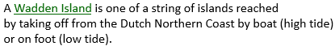

# Definition strategies

You can have different *strategies* for arriving at a definition that is fit for your purpose.

## Intensive definition: Describes characteristics

An **intensive** definition describes characteristics of things:

An intensive definition classifies things. An elegant strategy is to define “special cases” by leaving the explanation of the more general case to another definition:

The following classify, rather than define, individual concepts as being instances of a noun concept:

## Extensive definition: Enumerates instances

An** extensive** definition enumerates all the instances that are meant by the term you are defining:

This definition is great in the sense that it leaves no doubt about whether a given island is or is not a Wadden Island. On the downside, it does not help a reader grasp the *idea* of a Wadden Island.

Instead of commas, you can enumerate using a bulleted list.

This definition is a closed enumeration. All the instances are mentioned. This makes the definition formal. Sometimes you want to just give a number of examples and you cannot or do not want to mention them all. This is an open enumeration. To indicate that there are more instances, use an ellipsis symbol (three dots, ...) at the end.

## Operative definition: Instructs

An **operative** definition gives instructions. It tells you what you need to do to understand the meaning of the term:

## Ostensive definition: Shows

An **ostensive** definition shows, rather than describes, the meaning of a term.

> [!NOTE]
> SBVR 1.5 does not make an effort to classify definitions as types of proposition. (Their definition of 'definition’ talks about what a definition *represents.*) This is doubtlessly inspired by the fact that SBVR does not use the 'full sentence’ format but the 'term - definition’ format for definitions. USoft sees a formal definition as a type of structural rule.