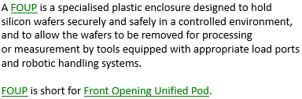

# Explanatory vs. stipulative definitions

By their intended effect, you can distinguish between** explanatory** and **stipulative** definitions. Stipulative definitions may be formal or not formal.

An **explanatory** or **informative** definition aims to help the reader understand what the defined thing is, or on what basis it can be distinguished from other similar types of thing. Definitions in dictionaries and encyclopaedias are of this type.

*Example*

A **stipulative** or **precising** definition lays down the law as to what readers are supposed to understand by the term in the vocabulary. It is much like a structural (or: definitional) rule in this sense.

*Example*

A **formal** definition is a stipulative definition that uses only terms that have themselves been defined in the vocabulary.

*Example*

Developers of USoft implementations can take formal definitions as a basis for coding an automated rule, in the same way that they can take formal rules as such a basis.