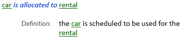
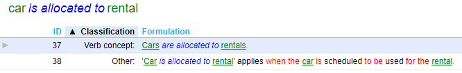
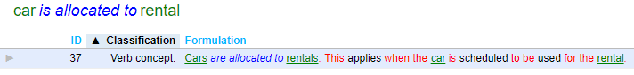

# What is a definition?

A **definition** is a statement that explains, clarifies, or specifies the meaning of a term. There are 2 popular formats.**In one format, the term defined is shown separately from the explanatory part:

|**Term**|**Definition**|
|--------|--------|
|car     |Four-wheeled motorised vehicle primarily intended for the transport of persons|

In another format, the definition is a single full sentence:

**"A car is a four-wheeled motorised vehicle primarily intended for the transport of persons”.**

USoft Studio supports only the second format.

## Defining a verb concept

The term may designate a noun concept, but it may also designate a verb concept. This is how SBVR presents definitions of verb concepts:

This is how you can define a verb concept in USoft Studio:

or:

As you can see, you need to make sure that the explanation contains all the noun concepts (green) but not the verb (blue).