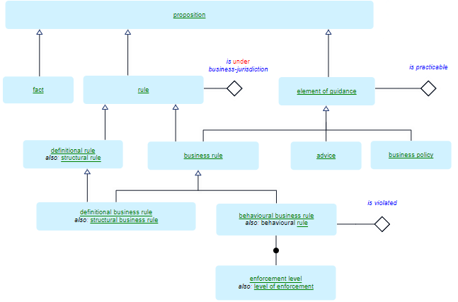

# Definitional rules and business jurisdiction in SBVR

In USoft Studio you write business rules and advices. They are *propositions*: statements that other people experience as being "true” or “false”. This makes it easy for them to validate their correctness.

SBVR 1.5 (Clauses 16-18) presents an elaborate typology of propositions:

Two key distinctions surface in this system:

*Distinction 1*

|**Definitional**|**Behavioural**|
|--------|--------|
|Something presented as a given|Something people are supposed to follow|
|Something that cannot be violated|Something that can be violated|
|Something that applies by definition|Something that is enforced|

If a definitional proposition does not include the phrase "by definition”, you could add it without changing its meaning. If something is true "by definition” then in their day-to-day business conduct people can do nothing to go against it: they cannot violate. Enforcement is not an issue.

*Distinction 2*

|**Under business jurisdiction**|**Not under business jurisdiction**|
|--------|--------|
|Something the owner of the rule has control over|
A law of nature

An external regulation

An internal policy
|

A vocabulary of rules and definitions is always owned. It could be owned by a commercial company or other organisation at large, but alternatively by some team or department within a company. If the owner has no control over a statement, but the statement is still relevant and must be complied with, then the rule is *not under business jurisdiction.* 

Laws of nature, external regulations and internal policies are things *not under business jurisdiction*. An external regulation is decided upon by an external agency (maybe a government) but the organisation wants to or is obliged to comply with the regulation. An internal policy is much the same, except that it is decided upon by a different party than the owner within the same organisation as the owner.

USoft uses these distinctions to make recommendations about the use of fact form vs. guidance form in USoft Studio formulations.