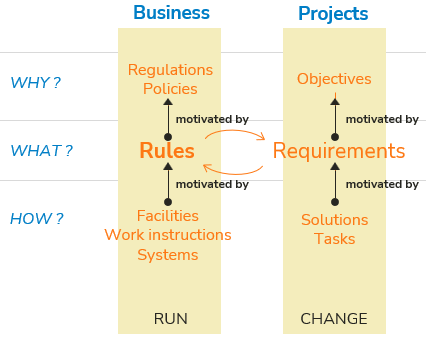
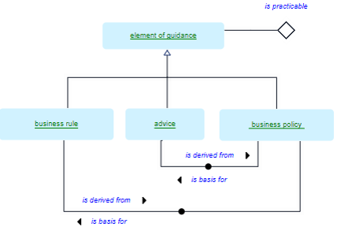
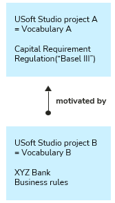
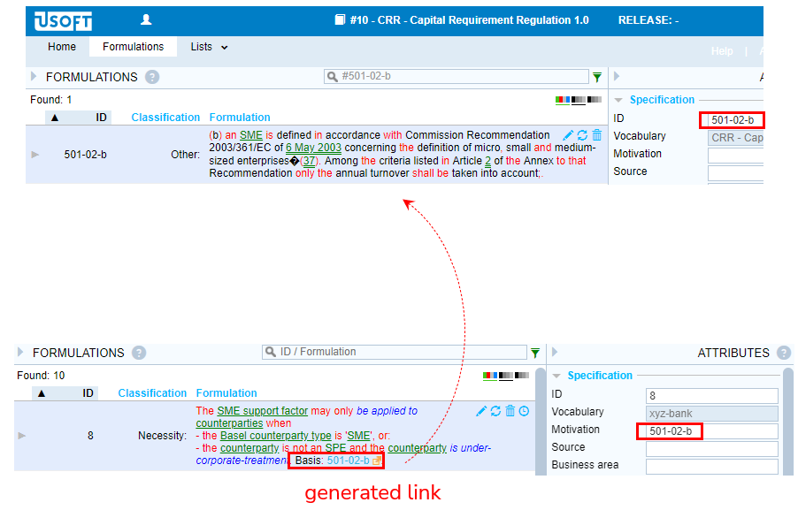
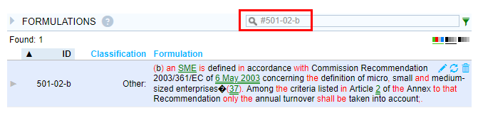
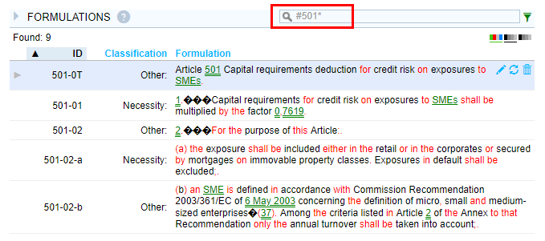
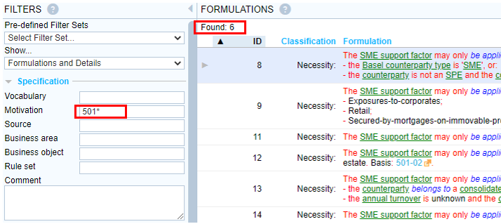
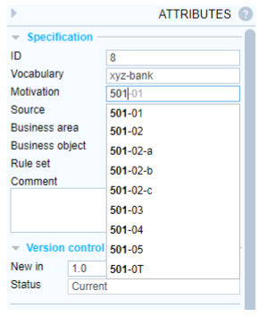

# Motivations

A **motivation** in a general sense is a reason why the organisation cares about something. The "something” could be a business rule but also a facility, work instruction, IT system feature, requirement, solution or task:

Looking specifically at business rules, the **motivation** of a business rule can be an external regulation or an internal policy.

An external regulation is a constraint that an organisation or department wants to or needs to comply with but that is not under its control (not under business jurisdiction).

An internal policy is a constraint that an organisation or department imposes on itself or that a different department, group or team within the organisation imposes. Policies are invented by the organisation itself.

A policy can be presented as a given. In this case, the vocabulary author should not be allowed to edit the policy. Use fact form.

A policy can be presented as being under business jurisdiction. In this case, they are an integral part of the vocabulary. A vocabulary author should be allowed to edit the policy. In SBVR terms, the policy is a *business policy.* An SBVR business policy is an element of guidance. Use guidance form.

## SBVR: "basis”

In the case of a policy, SBVR talks about its being a "basis” for business rules and advices:

In the case of regulations, technically, the regulation belongs to a different vocabulary. The organisation can *adopt* statements from a different vocabulary. This means that the organisation is committed to complying to the regulation without being able to change it.

For practical reasons, in USoft Studio, you can simply write the regulation in the vocabulary itself. Use fact form. You can use the Source attribute to tag the statement as coming from a different source.

## Beta implementation: Motivations as foreign keys

:::warning

This describes a Beta implementation that is not yet a production feature in USoft Studio.

:::

 An elegant way of accounting for motivations is by placing them in a **separate** vocabulary (or: USoft Studio project) and referring to them by Movation foreign keys (in other vocabularies) that refer to motivation IDs.

A bank could have a parent project containing Basel III capital requirement regulations (not under business jurisdiction) and 1 or more child projects (under business jurisdiction) that hold the bank’s business rules: the statements that word what the bank does to comply with the regulations.

Each business rule refers to a single item in the regulation. This is elegant because a business rule almost always has one *main* reason of existence, and it would be too much work to allow each rule to refer to multiple regulations - the resulting structure would also become too complex.

In this example, project B contains business rules and refers to project A which contains the Basel III regulation:

In the following picture, the top part shows project A and the bottom part shows project B.

A holds the legal text of the Basel III Capital Requirement Regulation. This content was produced by automatically segmenting the legal text into sentences (chiefly by assuming that each full stop symbol marks the end of a sentence) and applying some naming system to the IDs that communicates the place in the law where the statement comes from and, at the same time, provides a unique identifier. We have found that treating a legal text in such a way takes only a few hours of work and only needs to be done once. But the work cannot usually be re-used with another legal text. These statements typically have fact form.

B holds authored business rules that were entered by an author through the USoft Studio interface. These statements typically have guidance form. Authors can indicate that a statement is motivated by a specific element in the law. They do this by setting the Motivation attribute (on the right) to that item's ID.

The USoft Studio helpdesk team has a Beta implementation of a backoffice routine that, when activated through a button, (re-)synchronises the possible Motivation values in B with the ID values in A.

As the bottom part of the picture shows, this back office routine is also able to generate clickable hyperlinks at the end of the business rule text. When a reader clicks the link, the legal motivation is retrieved in a separate browser tab:

This may seem unattractive to readers, but the solution allows them to "zoom out” with ease by editing the search condition:

Standard tool features allow readers in B to query by a fragment of the law text. This gives them an overview of everything the bank does to comply with the specific fragment of the law queried by:

Standard dropdown list behaviour assists authors in choosing only references that actually existing in the law:

 