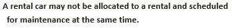
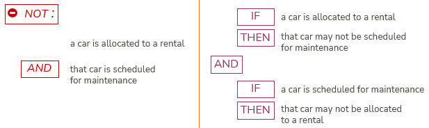

# Constraint implementation

As an alternative for forward chaining or backward chaining, you can think of a rule as a **constraint**.

The idea is that whatever happens, some situation is to be avoided. In a constraint implementation, a "red light” must go on when that situation threatens to come about:

This pattern of reasoning does not have direction: it does not "start” anywhere.

Instead, you focus on allowed and unallowed cases, not on triggering events.

 