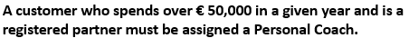
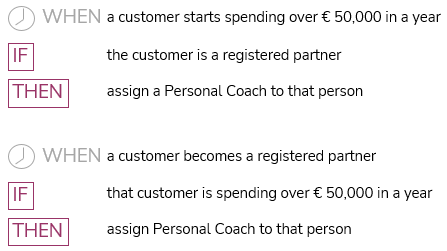

# Forward chaining

In human reasoning and rule implementations in software, **forward chaining** is the process of detecting an event that causes the rule to be in scope, checking that the conditions stated in the rule apply, and if they do, make sure that the action stated is executed or, in other words, the conclusion reached.

This is an Event - Condition - Action (ECA) approach.

With forward chaining, the interpretation is that action must be taken when a customer exceeds the stated limit, and when the person becomes are registered partner:

The drawback of this approach that it is easy to overlook that action is probably also necessary if a person ceases to have a Personal Coach, perhaps because the coach leaves the company, but the 2 preconditions still apply.