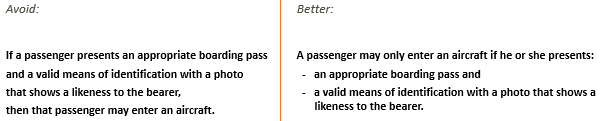
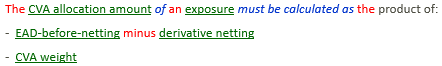
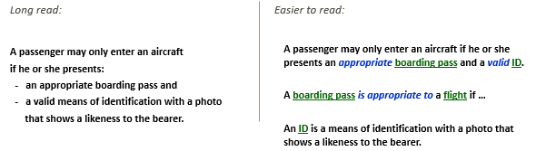
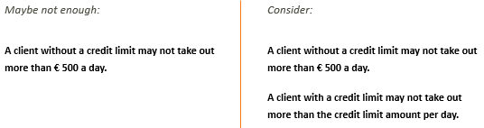
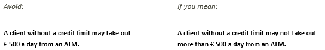

# Practical implications of reasoning for rule authors

## Patterns of reasoning are not your concern

People can **use** your rule for:

- Forward chaining
- Backward chaining
- Constraint implementation

The pattern of reasons that people choose is essentially **not your concern**, as long as you make sure that the rule is **correct**. But there are some best-practice tips.

## Consider if you can do without "if”

Forward chaining is "if - then - else” reasoning. The other patterns of reasoning make it clear that "if ...” is not the **only** candidate for writing rules. The risk of “if” is that your rule is only considered if the specific condition after "if” applies, but that in reality the rule also applies to other cases.

Consider if you can do without "if”:

- Can you answer a question that backward chainers want answered?
- Can you elegantly state a constraint: something that must never happen?

For an example, see the next section.

## Start with the main clause

A rule is often more readable if you start with the main clause.

## Accommodate backward chaining in mathematical calculations

For rules that say how a mathematical calculation must be performed, use **must be calculated**. This way, you start with the conclusion, so you accommodate backward chaining:

> [!TIP]
> Consider using mathematical **symbols** instead of words for mathematical operations. Consider also using abbreviations for the conditions, subtotals, and conclusion. This will make rules much shorter and greatly improve readability:
>  

## Offload information to other rules or definitions

You can offload information to other rules or definitions to make reading easier. In USoft Studio, the offloaded information is only 1 click away:

## Consider addressing remaining cases

A rule covers only the cases that correspond to the stated conditions.

Consider if you need complementary rules for other cases.

## Don't write an advice if you mean a business rule

If you mean to write a restriction, something that takes freedom away from people in the business, then don't just write an advice. Don't be tempted to write as a permission what is meant as a limitation:

 