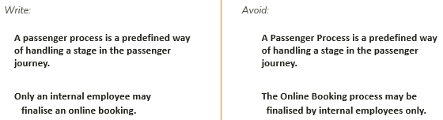
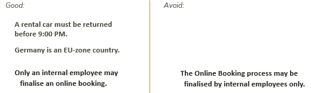
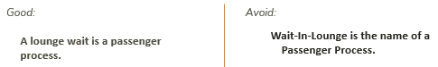

# Keep capital letters to a minimum

Keep capital letters to a minimum.

 

There are only 3 good reasons for writing a capital letter:

- As the first letter of a sentence.
- To respect the way that proper names are spelled. Proper names are names of individual concepts, for example companies, countries and brands.
- In phrases that are abbreviated. Make sure you spell the abbreviation with all-capitals (WHO). When you write out the name in full, use initial capitals (World Heath Organisation).

 

There is a link between avoiding capital letters and avoiding type concepts:

 

"Lounge wait” is better, because it is for countable, individual events. It is easier to write good business rules for countable, individual events, because business rules are case-based by nature.