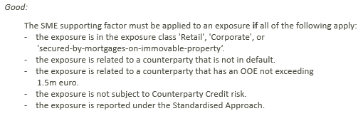

# Prefer who or that over if

Prefer **who** or **that** over **if**, if you can:

The difference may seem slight, but **if** adds a conditional clause which is best separated from the rest of the sentence by a comma. The construction with **who** does not need this: it is experienced more readily as a single sentence. This is easier to read and process. This consideration applies if you have only 1 condition, or few conditions.

**if** is often useful, for example if you have a long list of conditions:

 