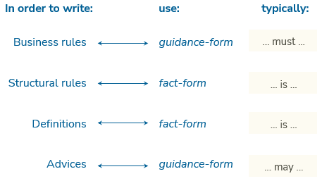

# Apply fact form and guidance form consistently

Make sure you apply [fact form](/docs/Authoring/Proposition_types/Fact_form_vs_guidance_form.md) and [guidance form](/docs/Authoring/Proposition_types/Fact_form_vs_guidance_form.md) consistently.

Write business rules and advices in **guidance form**. Write [structural rules](/docs/Authoring/Proposition_types/Definitional_rules_and_business_jurisdiction_in_SBVR.md) and definitions in **fact form**.

> [!TIP]
> This tip is a USoft best practice. It is glossing over a detail in SBVR 1.5, namely that SBVR does not exclude definitional rules that are under business jurisdiction. This tip is an attempt to express the close kinship between definitional rules and definitions, given also the possibilities of the USoft Studio tool design. For more, click [here](/docs/Authoring/Proposition_types/Definitional_rules_and_business_jurisdiction_in_SBVR.md).

In summary:

 