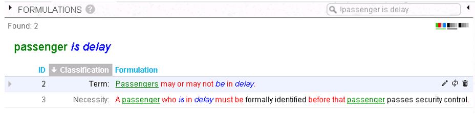
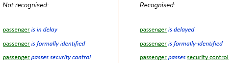

# Rephrase to a concept that USoft Studio recognises

USoft Studio cannot deal with all conceivable concept declarations.

*Example*

In SBVR it is possible to model unary fact types that USoft Studio does not recognise:

Get around this problem by rephrasing to a concept that USoft Studio does recognise:

 