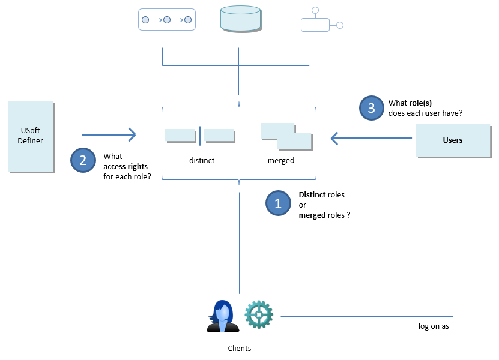

# How to plan authorisation

When you are ready to address authorisation of your application, take this 3-step approach.

## Step 1: Choose between distinct roles or merged roles

First decide whether you want to run with **merged** roles or with **distinct** roles.

In both modes, a user can have multiple roles, but there is an important difference:

- With **distinct** roles, only 1 of these roles is active at any one time. That active role determines what access the user has at that time. To get access to resources associated with the other role(s), he needs to switch to that other role.
- With **merged** roles, all those roles are active at the same time: he automatically has all the access afforded by any of his roles.

This choice is quite fundamental, because you are likely to organise roles and access rights differently depending on what you choose here. You can change this decision later, but that may involve having to make quite a few changes in role definition.

Versions of USoft prior to USoft 10.0 could only run with distinct roles. These roles were referred  to as *user groups.*

 

## Step 2: Define roles

Like Step 1, this step is a design-time decision that you make in Development in USoft Definer.

Decide in what different capacities users will make use of your application. For example, people who log on in the role of planner will need access to product data, and people who log on as salespersons will need access to contract and transaction data.

Because USoft is model-driven and data-oriented, you are likely to define the access rights for each role primarily in terms of access to **table data**:

- What **tables** does a role need access to?
- Does the role need to **manipulate** those tables or only to **read** those tables?

You can refine later, by adding access right definitions to components and jobs, and by differentiating access rights between columns of a table. You can also associate roles with different GUI entrypoints - the big step at this level is to define a First Menu Page for each role.

 

## Step 3: Define user-role associations

This Step 3 is a runtime decision that you make in Production in USoft Authorizer. But using the same mechanism, you can also differentiate access rights for different developers, testers and other team members in non-Production environments. This is because the USoft access control layer and its associated USoft Authorizer instance are a standard element of every USoft technology stack.

 