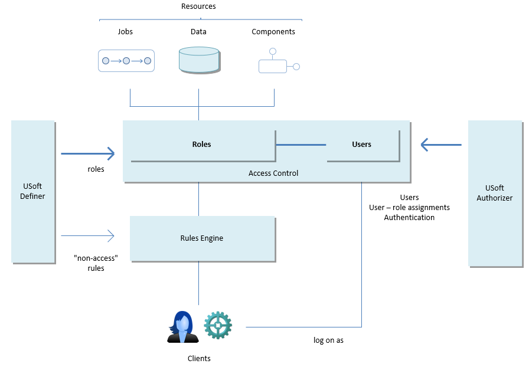

# Introducing USoft authorisation

In order to access data, jobs and components in a USoft application, a client needs to be known and recognised by the application (authentication) and she also needs **access rights** (authorisation).

Authentication and authorisation together ensure *access control***.**

Access is controlled partly in USoft Definer and partly in USoft Authorizer. What a user is allowed to do at runtime depends completely on the **role** (or roles) assigned to that user:

- In USoft Definer, at design time, you define the different roles**that runtime users play when they use the application. This involves specifying which jobs, data and components each role is allowed to access. This is separate from the "non-access rules" that determine the workings of the Rules Engine.
- In USoft Authorizer, you define the remaining aspects of access control. These are essentially two things: user - role assignments (which individual user has which role or roles?) and authentication rules (how is a user authenticated, by which procedure and which software component? Where are passwords or other means of authentication managed?)

The USoft Definer part is an integral part of application logic. This part of the work is in the hands of the development team. It is delivered to production servers through a delivery process.

By contrast, USoft Authorizer is a runtime application. The USoft Authorizer part of access control is in the hands of Systems Management or Application Managers.

Perhaps confusingly, USoft Authorizer runs in *every* setting where a USoft application runs, including Development environments. In other words, you control developer access to technical resources in USoft Authorizer in the same way that you control end user access in Production.

**Access control is a separate layer in any USoft application. Two tools, USoft Authorizer and USoft Definer, are used to define different aspects of access control.**

For help on role definition, please go to the USoft Definer Help (USoft Model and Rules Guide). This USoft Authorizer Guide covers user/role assignment and authentication defined in USoft Authorizer.

 