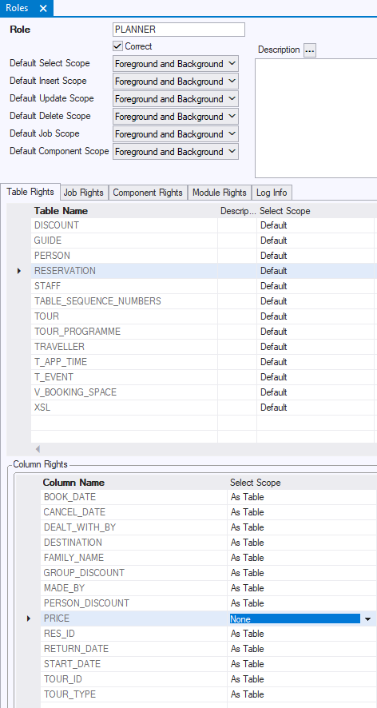

# Column rights

A **column right** is an access right that restricts a table right by making an exception for a specific column.
Conceptually, a column right is a unique combination of:

- The **table right** it restricts, which is itself a combination of Role, Table, and Access Type (Select, Insert, Update)*, and
- The **column** that the column right is about.

* Table rights can also have the Delete access type, but column rights cannot restrict this type of table right.

The column right is expressed by setting, for this combination:

- A **scope** value (Foreground-and-Background, Background-only, or None).

## Column foreground scope

In column rights, foreground scope has the following meaning. This is the same meaning as in table rights:

|**Access type**|**Meaning of Column Foreground Scope**|
|--------|--------|
|Select  |The right to query data in the column directly: to perform an action that identifies the queried column. This applies to queries in standard windows based on the table, but also to SELECT commands executed on the table from the SQL Command window.|
|Insert, Update, Delete|The right to manipulate column data **directly**, "from the surface". This applies to operations in windows based on the table, but also to explicit INSERT, UPDATE or DELETE SQL commands executed from the SQL Command window.|

 

## Column background scope

In column rights, background scope has the following meaning. This is the same meaning as in table rights:

|**Access type**|**Meaning of Column Background Scope**|
|--------|--------|
|Select  |The right to perform a query on the column data that is necessary **indirectly** to make some surface action possible. Examples of background SELECT are many:			
- For foreground UPDATE on a table, SELECT is a necessary step for the Rules Engine to retrieve the record in question. - For foreground SELECT from a Logical View, background SELECT is necessary on the underlying table(s). - For foreground action that triggers a restrictive constraint, background SELECT is necessary for the constraint to do its work. 
|
|Insert, Update, Delete|
The right to do something that **indirectly** triggers data manipulation on the column. This applies when you perform a surface action that triggers a constraint, something that happens away from the surface. The foreground "user action" requires foreground scope, but the triggered "constraint action" requires only background scope.

Background manipulation rights are required: 			(a) for actions that trigger data manipulation from constraints, 			(b) for actions that trigger the knock-on effect of cascading or nullifying Delete Rules and Update Rules of Relationships
|

## How to define a column right

To define a column right:
1.    Choose Define, Roles from the USoft Definer menu.
2.    Find the table right you want to restrict. First, retrieve the rights for the role. Then, on the Table Rights tab, click the line for the table right. See that the individual columns of the table are now displayed in the Column Rights box at the bottom of the window. By default, these have 'As Table' scope settings as in the picture below. 'As Table' means that the column right has the same scope level as the table right: in other words, the table right is not restricted by the column right, the column right has no effect.
3.    In the Column Rights tab, for the column, make Scope settings for the access type(s) where you want to add a restriction. In the example, the PLANNER role can see the whole of table RESERVATION but the column right takes away any right to see reservation prices (column RESERVATION.PRICE):

 

 

 

 

 

 

 

 

 

 

 

 

 

 