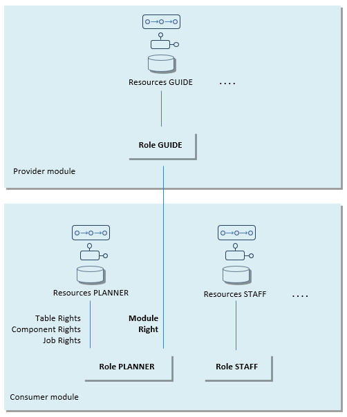
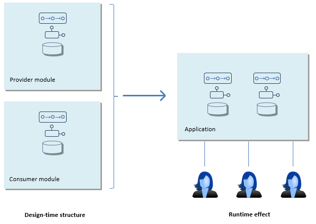
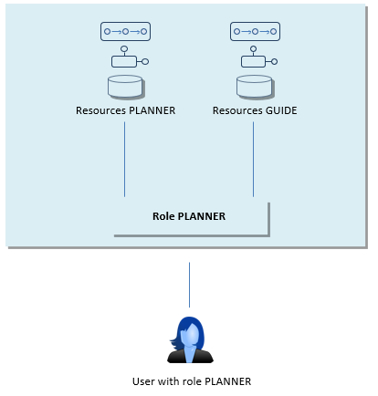

# Module rights

A role can have *module rights* on another role in a provider module. A module right gives access to all the resources that the module role has access to.

Here is an example design-time structure where role PLANNER not only has table, component and job rights, but also a module right for role GUIDE in a provider module:

When you deliver an application with modules, the runtime effect is that the modules are *combined.* The boundaries between modules are no longer relevant at runtime. Users see a mix of resources from all modules included:

The runtime effect of the module right of role PLANNER to role GUIDE is that runtime users who are given the PLANNER role have access to both PLANNER and GUIDE resources:

## How to define a module right

To give a PLANNER role in a consumer a module right to a GUIDE role in a provided module:

1. In the Development environment for the module, define the GUIDE role. Generate a .CON file (choose Tools, Create Flat Files from the USoft Definer menu.)

2. In the consumer application, make the consumer module known (choose Tools, Manage Internal Interfaces, Modules from the USoft Definer menu).

3. In the consumer application, make the role of the provider known. Do this by **synchronising**  the consumer with the provider. (Choose Tools, Manage Internal Interfaces, Consumed Interfaces. Declare where the .CON file of Step 1 was generated. Press the Synchronize button.)

4. In the consumer application, in the Roles window (choose Define, Roles), define or retrieve the PLANNER role.

5. On the Module Rights tab, see that available roles for Module Rights giving access to synchronised module(s) are listed. The key is the combination (Module, Role): it is possible to have multiple provider modules that have different roles with identical names.

6. Set Active = Yes for the GUIDE right of the module.

 

 

 