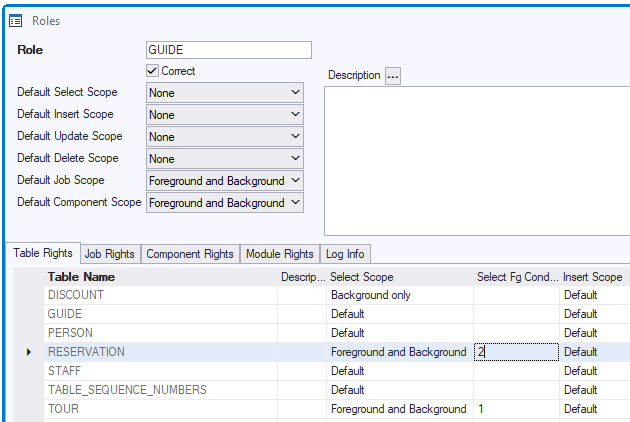

# Role conditions

A **role condition** is a SQL condition attached to a Table Right.

A role condition **restricts** the access afforded by the Table Right. Without the condition, the right would cover all the records in the table. With the condition attached, it covers only the subset of records that satisfy the condition.

The condition is like a WHERE clause that would restrict a query result to that subset of records if it were used as part of an explicit SQL SELECT statement.

### Syntax

In role condition syntax, the top-level WHERE keyword is understood but not written. Table aliases are allowed, but the table instance of the Table Right that you attach the condition to must be spelled in full. An alternative to this is the use of the special keyword alias:

```
tauth

```

which has meaning only in role conditions. This alias automatically represents the table instance of the access right that you attach the condition to. In theory, an advantage of using the **tauth** alias is that you can attach the condition to multiple Table Rights for different tables, but in practice that only works if those tables happen to have the same column names.

*Example*

This example is like a WHERE EXISTS clause. A user is allowed access to a table TOUR, but only to the subset of TOUR records that are linked (through a Relationship, a RELATE clause) to a parent record in a PERSON table that identifies her as the currently logged-in user (represent by keyword user).

The corresponding Table Right in this case is for table TOUR. Below are 3 alternatives.

*Syntax 1*

This syntax shows how you can represent the table instance of the access right by the **table name written in full**:

```
exists
(
    select   ''
    from     guide g
    where    g.person_id = tour.guide
    and      g.login_name = user
)

```

*Syntax 2*

This syntax shows how you can represent the table instance of the access right by the **tauth** keyword alias:

```
exists
(
    select   ''
    from     guide g
    where    g.person_id = tauth.guide
    and      g.login_name = user
)

```

*Syntax 3*

This syntax shows that the **tauth** keyword alias is also permitted as a table placeholder in RELATE clauses:

```
exists
(
    select   ''
    from     guide g
    relate   g "GUIDES" tauth
    where    g.login_name = user
)

```

### Scope of role conditions

A role condition can have either **Foreground** or **Background** scope, but this also depends on the Table Right it is attached to:

- Role conditions attached to SELECT rights can only have Foreground scope.

- Role conditions attached to INSERT, UPDATE and DELETE rights can have either Foreground or Background scope.
- Role conditions cannot be attached to a Table Right with Scope = None. There is nothing for the condition to restrict.
- Role conditions attached to a Table Right with Scope = Background-only must themselves have Background scope.

To an INSERT, UPDATE or DELETE right with Scope = Foreground-and-background, you can add restricting conditions for Foreground access and Background access **separately**. This gives you the option to restrict one type of access and not the other; to restrict each by a different condition; or to restrict both by the same condition.

### Defining a role condition

To define a role condition:

1. Determine the Role and the Table Right for which you want to restrict access by adding the new condition.

(Suggested:) In the C/S User Application, in SQL Command, try out the condition by appending it to a query (a SELECT statement) on the table. Once you are satisfied with the result, copy-and-paste the WHERE clause to the clipboard so that you can use it to define the role condition.

2. In USoft Definer, from the menu, choose Define, Role Conditions.

3. Write or paste your SQL condition in the Condition field, making sure you omit the top-level WHERE keyword. This keyword is understood but not written.

4. Save work. See that USoft Definer creates and displays a unique ID for your condition.

5. (See *Example* below.) From the menu, choose Define, Roles. Retrieve the Role where you want to use the condition. On the Table Rights tab, find the record for the table right that you want to attach the condition to. Depending on the access right (SELECT, INSERT, UPDATE or DELETE), and the scope (Foreground, Background), write the ID of the condition in the correct column. Save work.

> [!NOTE]
> The Role will now have Correct = No. Press the Check button to get it to have Correct = Yes.

*Example*

In this example, for users holding the GUIDE role, the role condition with ID = 2 has been attached. This condition restricts the record set in table RESERVATION that these users may SELECT from:



###  