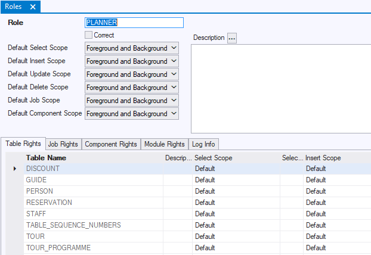
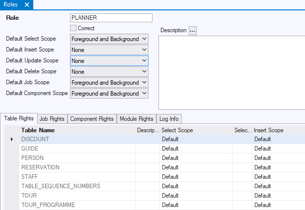
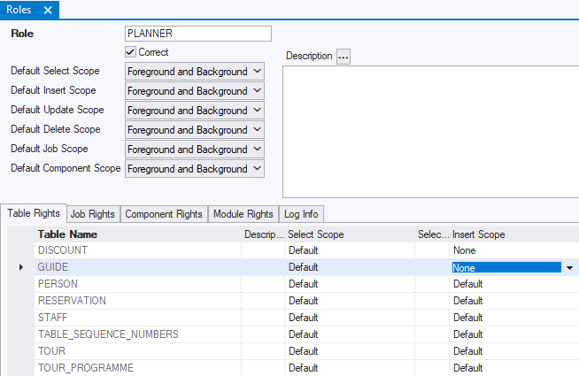

# Table rights

A **table right** is an access right that gives users access to data in a table or Logical View defined in the application itself, as opposed to: defined in consumed modules (access to the latter is given by module rights).

There are separate Select, Insert, Update and Delete table rights. These correspond exactly to the familiar operations in the SQL language with the same name: SELECT, INSERT, UPDATE, DELETE.
Conceptually, a table right is a unique combination of:

- The **role** that has the table right,
- The **table** that the table right gives access to,
- The **access type** that the right affords (Select, Insert, Update, or Delete).

The table right is expressed by setting, for this combination:

- A **scope** value (Foreground-and-Background, Background-only, or None).

## How users have access to tables

For each of the access types (Select, Insert, Update, Delete), a runtime application user has access to a table T if:

- The ROLE_MERGE Rules Engine parameter is set to False and the user's current role holds the table right to T for the access type. A user's current role is his default role as set in USoft Authoriser. During a session it is possible to switch to a different current role by calling RulesEngine.SetRole().
- The ROLE_MERGE Rules Engine parameter is set to True and any one of the roles that the user holds has the tagble right to T for the access type.

The exact runtime effect does not depend solely on the table right itself. Different access rights dependencies influence the runtime effect of a table right. See "Understanding roles and access rights”.

## Table foreground scope

In table rights, **foreground scope** has the following meaning:

|**Access type**|**Meaning of Table Foreground Scope**|
|--------|--------|
|Select  |The right to query the data directly: to perform an action that identifies the queried table. This applies for example when:			
- a user queries an info window based on the table in a USoft UI. - a user executes a SELECT statement on the table from the SQL Command window. 
|
|Insert, Update, Delete|The right to manipulate the data directly, "from the surface". This applies for example when:			
- a user creates a record (INSERT) in an infotst window based on the table in a USoft UI. - a user executes a SELECT statement on the table from the SQL Command window. 
|

## Table background scope

In table rights, **background scope** has the following meaning:

|**Access type**|**Meaning of Table Background Scope**|
|--------|--------|
|Select  |The right to perform a query that is necessary **indirectly** to make some surface action possible. Examples of background SELECT are many:			
- For foreground UPDATE on a table, SELECT is a necessary step for the Rules Engine to retrieve the record in question. - For foreground SELECT from a Logical View, background SELECT is necessary on the underlying table(s). - For foreground action that triggers a restrictive constraint, background SELECT is necessary for the constraint to do its work. 
|
|Insert, Update, Delete|
The right to do something that **indirectly** triggers data manipulation. This applies when you perform a surface action that triggers a constraint, something that happens away from the surface. The foreground "user action" requires foreground scope, but the triggered "constraint action" requires only background scope.

Background manipulation rights are required: 			(a) for actions that trigger data manipulation from constraints, 			(b) for actions that trigger the knock-on effect of cascading or nullifying Delete Rules and Update Rules of Relationships
|

## How to define a table right

> [!TIP]
> When defining table rights, be aware of dependencies between rights. For example, if you define access to a subtype table, also think of access to the supertype. If you define access to a Logical View, also think of access to the underlying table. To some extent, USoft Definer helps you by implementing dependencies automatically.

To define a table right for a role:
1.    Choose Define, Roles from the USoft Definer menu.
2.    If the role already exists, retrieve the record for the role. If the role is new, type the role name in the Role field, save, then press F5 (Refresh) to see the application tables listed on the Table Rights tab.

You can see that by default, all the Table Rights have the value 'Default'. This 'Default' value represents the scope setting for the role-level defaults in the upper part of the window ("Default Select Scope", "Default Insert Scope" and so on):

The picture shows a newly created role. You can see that, by default, a role has full access: all the tables have "Foreground-and-background" scope for all the access types (Select, Insert, Update, Delete).
3.    If this is what you want, you are done. If you want to restrict table rights in some way, you now have a choice. If you want to make the same settings for all the tables, or nearly all the tables, then change the role-level defaults in the top of the window. In this example, the PLANNER role still has full read-only access, but no longer any other type of access to the tables:

If you want to make a setting that is specific to one table, or only a small group of tables, leave the top-level default settings alone. Instead, make the setting on the Table Rights tab. In this example, the PLANNER role has Insert rights on most tables but not on DISCOUNT and GUIDE:

 

 

 

 

 

 