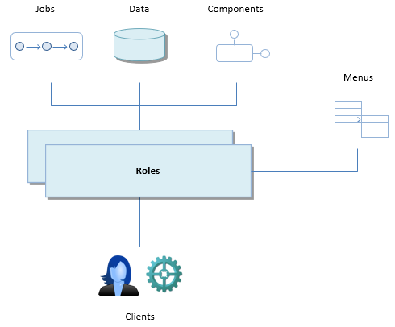

# Understanding roles and access rights

In functional terms, a **role** is a capacity in which a user makes use of a USoft application.

For example, people could "do Sales things" in an application because they have the "SALES" role. Other people could "do Marketing things" in that same application because they have the "MARKETING" role.
It is also possible to allow people to do both "Sales and Marketing things" by giving them both roles. If you have Marketing people, but also a different group of people who should have access to Marketing things only as a reader, you probably want to create some additional role, perhaps named "MARKETING_READER".

In more technical terms, a role is a collection of resources that people have access to if and when they are associated with the role. A role gives them the **right** to access the resource. A resource may be a **data element**, a **job**, or a **component** (an RDMI component).

The only way in which a user (a client) can have access to data, jobs and components is through roles.

A USoft application always runs either with "merged roles" or with "distinct roles". With "merged roles", users who have multiple roles automatically have access to all the corresponding resources at the same time. With "distinct roles", they have access to one role at a time, so they need to be given a means to switch to a different role.

Roles may be associated with specific **menus**, submenus, or menu options by working with **First Menu Pages**. Menus are a way of guiding users to whatever resources they have access to. Menus are specific to USoft GUIs.

Using **extension properties**, you can define extra runtime settable properties for a role. Using **schemas**, you can generate such properties from a SCIM schema.

**The only way that USoft clients have access to data, jobs and components is through roles. Menus are a GUI aspect of roles.**

:::note

In earlier versions of USoft, roles (then called "user groups") were associated only with data and menus. Access rights to jobs and components are a new feature in USoft 10.0. In many existing USoft applications, a job's purpose is ultimately to query or manipulate data: the job is a "way in" or access path to the data, and people had the right to execute the job because they had the right to access the data. The two layers are now separate. Because of the versatily of components, which open the door to any coded world, a component right can mean just about anything: its (indirect) goal may or may not be related to application data. It is likely that in the future, there will be more and more job rights and component rights that primarily control access to *functionality* rather than to *data*.

:::

## Overview of access rights

A role is a collection of access rights for access to tables, columns, jobs, components and modules. These different resources have different types of access right.

In this table, resource names appear on the left. Access rights appear across the top. Access right names between parentheses are *logical names,* not physical names, in that do not actually appear in the USoft Definer tool interface.

----

The DDL right listed in the table is introduced in USoft 11. It does not apply to USoft 10.

----

|** **   |**Select**|**Insert**|**Update**|**Delete**|**(Execute)**|**(Call)**|**(Inherit)**|
|--------|--------|--------|--------|--------|--------|--------|--------|
|DDL     |No      |No      |No      |No      |**Yes** |No      |No      |
|Table   |**Yes ***|**Yes ***|**Yes ***|**Yes ***|No      |No      |No      |
|Column  |**Yes** |**Yes** |**Yes** |No      |No      |No      |No      |
|Job     |No      |No      |No      |No      |**Yes** |No      |No      |
|Component|No      |No      |No      |No      |No      |**Yes** |No      |
|Module  |No      |No      |No      |No      |No      |No      |**Yes** |

* Possibly subject to a restricting role condition

DDL rights (USoft 11 only) are the rights to Create, Alter or Drop database tables, that is, tables known to the RDBMS. DDL is a subsection of the SQL language. DDL is short for Data Definition Language. You need DDL rights in order to run the USoft "Create Tables” routine for any application (be it Authorizer, Definer, or the User Application you are developing). DDL rights are all-or-nothing, across-the-board rights: either you have DDL rights and you are allowed to run Create Tables for any application, or you do not have these rights and you are not allowed to run Create Tables for any application.

DML rights are the rights to Insert, Update or Delete data in tables. DML rights are shaped by a combination of table rights and column rights.

Tables are accessed through a system of Select, Insert, Update and Delete access rights called **table rights**. These correspond exactly to the familiar operations in the SQL language: SELECT, INSERT, UPDATE, DELETE. Columns are affected by table rights, but possibly also by specific **column rights**. Column rights have the same access rights as Tables, except for Delete, since Delete always applies to entire records and not to individual columns.

Logical Views are subject to "table rights" in the same way as database tables. See " Access rights for different table types " for details. Access rights to subtype tables also require special consideration.

A table right may be subject to a restricting **role condition** (or 'condition', for short.) In that case, the condition restricts the right to only a subset of records in the table. Column rights cannot be subject to role conditions.
Jobs have only an Execute right, simply referred to as **job right**. If you have a job right, you are allowed to execute the job, or to have the job executed on your behalf.
Components only have a Call right, simply referred to as **component right**. If you have a component right, you are allowed to call methods of that RDMI component, or have the application do that on your behalf.
Modules only have an Inherit right, simply referred to as **module right**. In an application that consumes modules, a module right is the fact that a given role has ('inherits') all the access rights to consumed resources that some role in the provider module has.

## Scope

Each access right has a **scope**. The higher the level of the scope, the more access you have:

|**Scope**|**Meaning**|**Level**|
|--------|--------|--------|
|Foreground-and-background|
The ability to exercise the access right in the foreground, AND:

The ability to exercise the access right in the background.
|2       |
|Background-only|The ability to exercise the access right in the background only.|1       |
|None    |The absence of ability to exercise the access right, whether in the foreground or in the background.|0       |
|Default |
Placeholder for one the scope levels 0-1-2.

If (eg.,) a Table has a Select right with Scope = Default, the level is indicated by the role's "Default Select Scope" attribute.

This defaulting mechanism does not apply to DDL rights because, independently of named objects, a given role either has all DDL rights, or has no DLL rights at all.
|(0, 1 or 2)|
|As Table|
Placeholder for one the scope levels 0-1-2.

Column Rights only.

If a Column has (eg.) a Select right with Scope = As Table, the level is indicated by the "Select Scope" attribute of the table right that the column right belongs to.
|(0, 1 or 2)|

## Access right dependencies

You cannot have just any combination of access rights. Access rights have logical and technical **dependencies** between them.

Some dependencies have been implemented in the USoft Definer tool by automatic behaviour. When you set or change one access right, you will find USoft Definer sets or changes another (dependent) access right automatically:

- Either you see the dependent change immediately in your screen, OR:
- You must refresh or re-query in order to see the dependent change in your screen.

Other dependencies have NOT been implemented by automatic behaviour. This type of dependency you must implement manually: you must remember that without the second right, the first right is useless.

Here are some access right dependencies:

|**Subject area**|**Dependency**|**Implemented by automatic behaviour?**|**Example**|
|--------|--------|--------|--------|
|Column rights and table rights|If you have a Table Right, each corresponding Column Right must have the same scope level or lower: the Column Right must be the same as the Table Right, or it must *restrict* the Table Right.|Yes     |If you have Select=None for a Table, you also have Select=None for all the columns of that table.|
|
INSERT and SELECT rights

UPDATE and SELECT rights

DELETE and SELECT rights
|If you have a Insert, Update or Delete right on a table (level higher than None), you must also have at least Background Select rights on that table.|Yes     |If you set Insert = (higher than None) for a table, the Select right for that table changes automatically to Background if Select scope was lower.|
|Logical Views and underlying tables|If you have a Select right on a Logical view, you must have at least Background Select on all the underlying tables.|Yes     |If you set Select = Foreground-and-Background for a Logical View, the Select right for each underlying table changes automatically to Background if that scope level was lower.|
|Subtype tables and supertype tables|If you have a Select, Insert, Update or Delete right on a subtype table (level higher than None), you must also have that same right on the supertype table.|Yes     |If you set Insert = (higher than None) for a subtype, the Insert right for the supertype changes automatically to the same scope level if that level was lower.|
|Components and component tables|
If you have any Table Right on a component table, you must have at least the Background Call right on the associated component.
|Yes     |If you set Select = (higher than None) for a component table, the Call right on the associated component changes automatically to Background if that scope level was lower.|
|Jobs and subjobs|
If you have an Execute right on a job J1, you must also have at least the Background Execute Right on any job J2 called by J1, regardless of whether the job call is a Job Task of type Job or a SQL Task that performs:

`INVOKE batchrunner.j2 ...`
|No      |If you give a Job Right with scope = (higher than None) for a job J1 calling job J2, then the end user gets an error when executing J1 if you do not also give a Job Right with scope = Background or higher for J2.|
|Jobs and components|If you have an Execute right on a job J1, you must also have at least the Background Call right on any component COM1 called by J1.|No      |If you give a Job Right with scope = (higher than None) for a job J1 calling component COM1, then the end user gets an error when executing J1 if you do not also give a Component Right with scope = Background or higher for COM1.|
|Jobs and queried tables|If you have an Execute right on a job J1, and J1 queries data from table T1, you must also have at least the corresponding Background right on T1.|No      |If you give a Job Right with scope = (higher than None) for a job J1 that SELECTs data from table T1, then the end user gets an error when executing J1 if you do not also give a Table Right with Select Scope = Background or higher for T1.|
|Jobs and manipulated tables|If you have an Execute right on a job J1, and J1 manipulates data in table T1, you must also have at least the corresponding Background right on T1.|No      |If you give a Job Right with scope = (higher than None) for a job J1 that INSERTs data into table T1, then the end user gets an error when executing J1 if you do not also give a Table Right with Insert Scope = Background or higher for T1.|

## How to understand access rights dependencies

It is important to realise that access right dependencies (previous section) do not have deep logical meaning. Some have a logical reason, others have a technical reason, or a mix of the two.

USoft has made relatively arbitrary semantic choices in this area. In the USoft system, table rights *override* column rights. It could be argued equally well that the purpose of a column right should be to override the corresponding table right - for that column only. But no: having more scope at column level than at table level is *considered* an incongruity. A similar point could be made for the other types of access right dependency.

Other dependencies have a more technical reason. In a USoft application, you cannot perform an INSERT, UPDATE or DELETE in a table without also having the Rules Engine perform a query (SELECT) from that table under the hood. It is quite easy to see why and how. Just record a profile of any data manipulation operation in USoft Benchmark, and then inspect the profile steps. This technical dependency is given form in the visible access rights dependency. This is not so much a semantic decision by USoft, but rather a decision to have access rights reflect the workings of the Rules Engine.