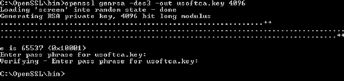

# SSL Step 2: Create a private key

For this example, we are going to create a private key called **usoftca.key**. Note that in this version, if you make your own key you must also  use this file name:

Open a DOS (command prompt) window and change directory to **\\openssl\\bin**  or the **\\bin** subfolder of your OpenSSL installation location.

**openssl genrsa -des3 -out usoftca.key 4096**

> [!NOTE]
> You must use the filenames specified in these examples.

 

You should see something like the following:

Provide a pass phrase, and remember it! You will need it later in the procedure.

You should now have  a file called **usoftca.key** in the \\bin subfolder of your OpenSSL installation location.

Go to Step 3: Create a master certificate based on private key.

 