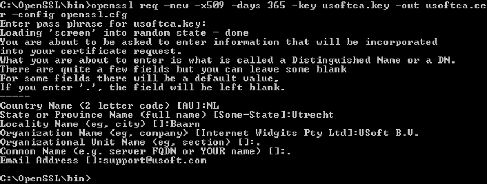

# SSL Step 3: Create a master certificate based on private key

In this step we will create a master certificate based on the private key that was created in Step 2.

This master certificate (**usoftca.cer**) will be used when signing other certificates.

If you do not already have one open, open a DOS (command prompt) window and change directory to **\\openssl\\bin**  or the **\\bin** subfolder of your OpenSSL installation location.

In the DOS window, type:

**openssl req -new -x509 -days 365 -key usoftca.key -out usoftca.cer -config openssl.cfg**

:::note

You must use the filenames specified in these examples.

:::

 

You will now have to supply the pass phrase and various other data that will be incorporated into the certificate request. You should see something like the following:

You should now have a file called **usoftca.cer** in the \\bin subfolder of your OpenSSL installation location.

Go to Step 4: Create certificate signing request.

 