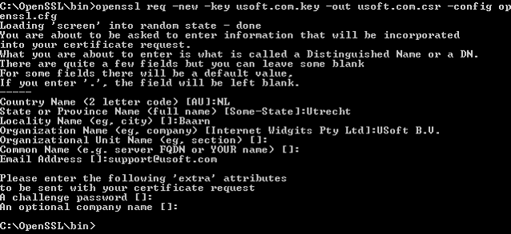

# SSL Step 4: Create public key and certificate signing request

In this step we will create a certificate signing request. This is the file (in this case usoft.com.csr) that is used to send to the Certification Authority to request confirmation of your identity. All Certification Authorities will ask for this file when applying for a certificate. You can also use this file to self-sign a certificate.

First we need to generate a public key (in this case **usoft.com.key**).

If you do not already have one open, open a DOS (command prompt) window and change directory to **\\openssl\\bin**  or the **\\bin** subfolder of your OpenSSL installation location.

In the DOS window, type:

**openssl genrsa -out usoft.com.key 4096**

:::note

For this version, you must use the filenames specified in these examples.

:::

 

You should see something like the following:

You should now have a file called **usoft.com.key** in the \\bin subfolder of your OpenSSL installation location.

We now need to generate the Certificate signing request (usoft.com.csr) . In the DOS window opened above, type:

**openssl req -new -key usoft.com.key -out usoft.com.csr -config openssl.cfg**

 

:::note

For this version, you must use the filenames specified in these examples.

:::

 

You should see something like the following:

Provide the extra attributes. You should now have a certificate signing request file (**usoft.com.csr**) that contains the  server public key . If you need a CA signed certificate, this is the file you will have to send to the CA.

Go to Step 5: Self-sign the certificate.

 