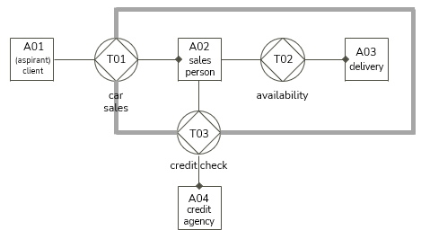
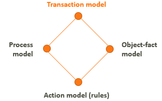
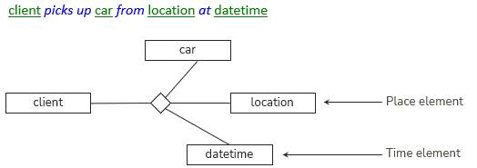
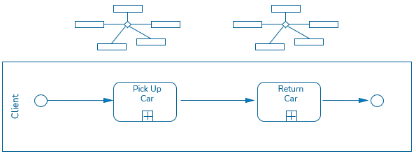
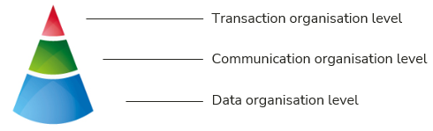

# Core business events

## Business area

When a project starts, there are always objectives or assignments or designs that tell you in general terms which **business area** you need to understand and cover.

Even though USoft Studio allows you to divide rules and definitions by Business Area, **don't** spend time at an early stage doing this. Early on, you don't want to worry about what's in and what's out of a specific business area. Likewise, **don't** start by worrying about subdivisions (as you would by inventing chapters and subchapters of a book). These delimitation and naming exercises are hard to complete as long as you don't know much about what goes on in the business area.

Instead, start by identifying **core business events** that seem to be at the centre of the area you are looking at.

## Core transactions

Enterprise Ontology models a business area primarily in terms of core transactions. Here is a diagram that depicts such an analysis for the business area of car sales at a car dealer. An explanation of this technique is [here](/docs/Business%20rules/Positioning%20business%20rules/Enterprise%20Ontology.md).

 

Each transaction follows standard patterns of production and negotiation. A transaction is seen as a cluster of activities that always follow more or less the same pattern. Here is the break-up to T01 into a standard pattern of 4 communication acts and 1 production act:

----

client*requests*car

salesperson*promises*car

salesperson*produces*car

salesperson*states*car

client*accepts*car

----

As you can see, each can be made to correspond to an SBVR verb concept. SBVR is a natural-language methodology and as such, and unlike Enterprise Ontology, is (also) concerned with what people in the business *actually say,* so you are likely to want to replace "promise” by something like "reserve” and maybe skip "state” altogether. But the general idea is clear: transaction analysis can help identify core business events with ease.

## Transactions as a heuristic strategy

Even if you don't “do” Enterprise Ontology, you can still use transactions as a *heuristic*: an architectural idea that you can keep in mind and that helps you make decisions when you create an SBVR model. This is because transactions are highly related to processes, concepts and rules. The idea is that processes, concepts and rules only exist because they follow in some way from a transaction: transactions are the key. In terms of the 4 aspect models of Enterprise Ontology:

Interrelationships between transaction acts and SBVR concepts show up in verb concepts, for example, this n-ary verb concept. This example makes it particularly clear that SBVR models *events* or *acts:* the concept "happens” at a specific time and place:

SBVR verb concepts can also be seen to map implicitly or explicitly to BPMN activities in a process flow:

To complete the picture and show the interrelationship with data, Enterprise Ontology offers a 3-tier view of how business organisations depend on each other. Again, transactions are key. The 2 lower levels only exist as a consequence or corollary of the transactions happening:

One of the ways in which this maps to work in USoft Studio and SBVR is that you do not need to limit yourself to core business events. They are interlinked with communication acts, which in turn lead to the accumulation of data. The two lower levels are realities in their own right, with their own concepts and business rules that you may want to describe and model.