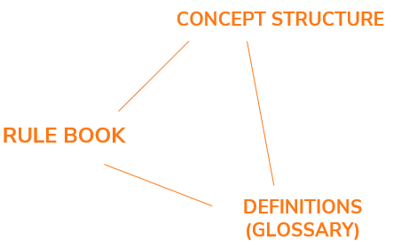

# The need for a general approach

## Business reality

A USoft Studio model (project, vocabulary...) is primarily a collection of business rules, terms and definitions, and concept structure, possibly visualised in supporting SBVR diagrams.

When you create such a model, you are confronted with the task of modelling **business reality.**

It is very easy to do this the wrong way, because business realities are bewildering amalgams of people, tasks, objects, objectives, data and messages, and you can write many types of natural-language statements that describe all these aspects of all these subjects.

## What you deliver

You deliver a well-described and well-structured combination of a rule book (business rules, advices), a glossary (terms and definitions), and a concept structure. The concept structure is possibly visualised in supporting SBVR diagrams.

These 3 support each other. When they are finished, there is no particular hierarchy, all 3 are equally important:

Because these 3 are highly interdependent, the most natural way to create them is to build them all in parallel and progressively, in any tempo and order that you see fit. Let rules be leading: don't model concepts that do not surface in rules.

These deliverables are excellent at **micro-level**:

- Quality business rule writing
- Highly available glossaries of terms and definitions
- Well-structured concepts

Work with business rules in USoft Studio is inherently non-ordered. This is one of its strengths: you are allowed to work in any order, and the tool will still help you achieve a valid result, mainly because it creates and displays so much structure and cross-references automatically.

But USoft Studio and SBVR are not so good at **macro-level**. They don’t help you with architecture, with over-arching design. You need additional modelling techniques to supplement this shortcoming. USoft suggests you use Enterprise Ontology for this purpose. An architecture approach tells you where to start, which steps to take, what is essential and what is accidental, and how you can check that you are still on track.

 

 