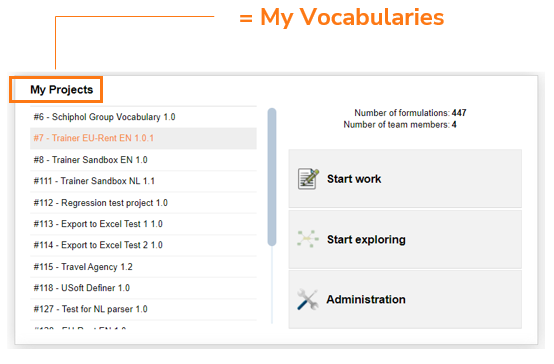

# The need for project management

## USoft Studio is not a project management tool

The Home page of USoft Studio has a tile entitled "My Projects”. This word has been chosen to give credit to the fact that professionals in the IT industry mostly use “project” when they talk about their work.

It would be more exact to talk of 'vocabularies’ instead. (In USoft Studio, 'project’ and 'vocabulary’ are the same thing exactly.)

The tools supports the creation, use and maintenance of **vocabularies**: meaningful, well-defined and well-structured collections of rules, terms and definitions. These vocabularies are **sustainable** because they tend to express business-critical knowledge that is fairly stable over time and is likely to be re-used in later projects.

By contract, the tool does not help you conduct and monitor your IT project (whether or not you are implementing a USoft software application as part of it). Other methods, techniques and tools are much better at project management. The tool just assists you by offering a number of *attributes* that allow you to keep track of certain project aspects, such as the Approved flag. You can use that flag to document that a rule was approved, but also to assign the task of approving it to a specific team member.

## The need for project management

An IT project is necessary for controlled objectives, priorities, contract negotiation, budget, timeframes and resource allocation. A USoft Studio vocabulary is almost always created in the context of an IT project.

The USoft Studio tool and the USoft/SBVR business rules methodology do not offer project management.

**You need a project management method, such as Agile, to conduct your USoft project.**

**You need to use a project management tool, such as Jira,** **in parallel with using USoft Studio.**