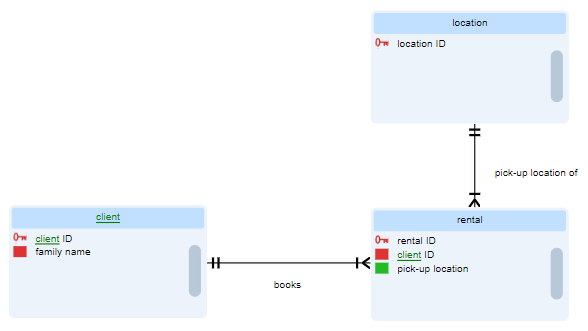
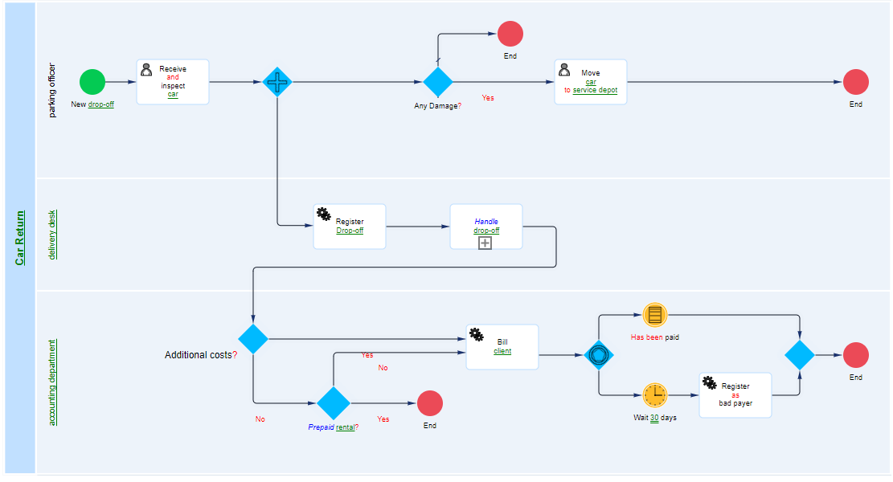
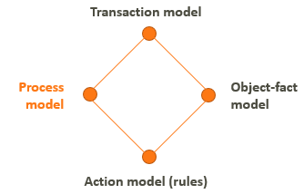

# Tips for a good start

Here are some general tips for a good start with USoft Studio and business rules.

|**DO**  |**DON'T**|
|--------|--------|
|Apply general **information analysis skills**|Start with (new) EAR diagrams|
|Start with **core business events**|Start with (new) BPMN diagrams|

## Information analysis skills

USoft projects require general information analysis skills that apply to all IT projects and are well-established in methodologies such as Agile. This article is not the place to detail these skills, but let's identify some of them.

**Fail quickly:** Present rules, definitions and concept structure to the client early on, and take their feedback and criticism to heart. Organise small, informal and frequent feedback loops.

**Start small:** Don't get carried away by doing too much before you ask feedback. Make sure people are impressed by the quality of your work, rather than the size.

**Organise the help of domain experts** upfront. Before you start, or as part of contract negotiation, state how much time and effort you will need from them.

**Ask around:** Don't miss stakeholders.If the client has good existing documentation, don’t miss it, make sure you use it.

## Don't start with (new) EAR diagrams

Here is an example of the type of core business event that maybe you don't want to model quite like this (as an n-ary verb concept), but certainly want to use and understand as a subject to formulate rules around:

Here is an EAR data diagram that covers the same area from a data point of view:

EAR is essential for creating USoft applications. But, as you can see, EAR is not suitable for grasping and understanding core business events. Data modelling is different from business modelling.

For understanding business events, data modelling focuses too much on what is recorded in the database and what is not, and on what is technically required and desirable in a relational database.

## Don't start with (new) BPMN diagrams

Here is an example of a BPMN diagram:

Steps in process flow are depicted from left to right. Swimlanes are used to show who does what.

BPMN focuses one-sidedly on the *order* in which process steps occur in time. For understanding business events, BPMN focuses too narrowly on this aspect. This will distort your view, because other aspects in business modelling are just as important as process steps.

Enterprise Ontology distinguishes 4 closely related aspect models that *together* allow a good understanding of business organisation. BPMN maps to only 1 of them (in orange):

Enterprise Ontology, 4 aspect models## Start with core business events

Start your business vocabulary by identifying and focusing on core business events.