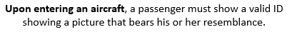
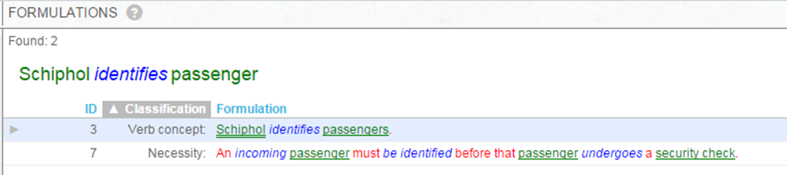
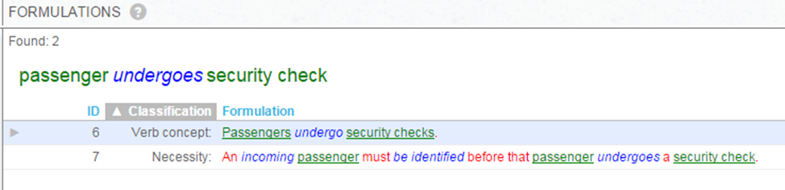

# A good element of guidance is fact-based, not event-based

:::note

**Summary:**  A rule or advice typically does not say when it is needed.
[More SBVR principles for good elements of guidance](/Business_rules/Good_elements_of_guidance/Good_elements_of_guidance.md)

:::

Elements of guidance are fact-based, not event-based. They say *what must be the case.* They don't usually say *when something is to happen.*

As an author of business rules and advices, you can concentrate on *what* is necessary or allowed. An element of guidance does not need to say *when* it is needed:

- Must the person have a valid driving license when *registering* as a driver in a rental?
- Must the person have a valid driving license when taking place at the steering wheel?

The element of guidance does not answer these questions. As a reader or developer, you must *interpret* the element of guidance and assess yourself when this rule is needed.

There are always exceptions. The following rule is so tightly related to the situation in which it applies that this situation is simply stated as part of the rule:

## When is a rule *needed* ?

A rule does not usually say when it is needed. This is not usually immediately clear. Also, there could be multiple different events where the same rule is needed.

*Example 1*

When is this rule needed?

- When a customer places a new order?
- When a new book year commences?
- When a personal coach who already serves customers leaves the company?

*Example 2*

When is this rule needed?

- When the passenger passes customs?
- When the passenger passes a security gate?

USoft Studio is able to *present* the rule automatically in multiple situations. In this example, it will present the rule in 2 places because 2 binary verb concepts indicate moments when it could be needed:

*Presentation 2.1*

*Presentation 2.2*

 