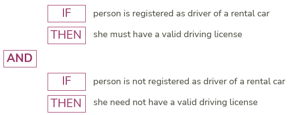

# A good element of guidance is severable

:::note

**Summary:**  When a rule or advice is changed or dropped, "the rest will still work”.
[More SBVR principles for good elements of guidance](/Business_rules/Good_elements_of_guidance/Good_elements_of_guidance.md)

:::

SBVR's principle that a good element of guidance is *severable* (separable) is double-edged: first it tells you that the ideal is that a business rule or advice can stand on its own, that it can be appreciated independently of surrounding elements of guidance; second it tells you that it will be evaluated as part of a collection of elements of guidance that together build a picture of what people can and should do in practical situations.

Here is the exact wording of the Severability Principle of SBVR 1.5 (16.3.1):

"The meaning of an element of guidance may be expressed separately from any other element of guidance; nonetheless, a body of shared guidance that includes the element of guidance will be evaluated as if all the elements of guidance had been expressed jointly and all had to be true”.

As the author of a business rule or advice, concentrate on that element of guidance itself. Do not attempt to refer to other separate writings for further explanation. With SBVR, all the information is contained in the element itself as much as possible. You can still write definitions of terms, and you can still add notes and comments to individual items for clarification.

## "Elements of guidance may be expressed separately”

One aspect of this first part of the principle is further explained by SBVR: "If one business rule is invalidated or violated somehow, the rest still apply”.

This reflects how USoft Studio works. If you take a formulation away, all the other formulations remain untouched. The only thing that happens is that if the other formulations referred to or depended on the dropped formulation (in colour-coding, hyperlinking), that reference or dependency is automatically removed.

This reflects also how constraints work in USoft Rules Engine implementations. If you drop or change one constraint, all the surrounding constraints continue to be enforced unaltered.

## "Body of shared guidance is evaluated as if all the elements of guidance had been expressed jointly”

Elements of guidance that are part of the same vocabulary (in USoft Studio also: the same "project”) are evaluated as if they are all meant to be true at the same time.

This puts a limitation on the severability of the items: they form a whole, which means they should not contradict each other.

As SBVR puts it, “this … principle is the business counterpart to what in propositional logic is often called the *universal AND*”. Say that you have the following business rule and the following advice:

The idea of "universal AND” is that you must interpret this situation as if the two are connected by a logical AND operator:

 