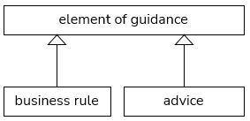

# Good elements of guidance

In USoft Studio you can write business rules and advices: *elements of guidance*.

SBVR 1.5 presents fundamental principles of good elements of guidance. From these principles, we can derive tips for you as an author: when are your elements of guidance *good*?

Here is a summary of the principles and what they mean for you as an author, reader or developer.

## Summary

|**Principle**|**What does it mean for you?**|
|--------|--------|
|[A good element of guidance is practicable](/docs/Business%20rules/Good%20elements%20of%20guidance/A%20good%20element%20of%20guidance%20is%20practicable.md)|A rule or advice tells people in a practical situation how to act|
|[A good element of guidance is severable](/docs/Business%20rules/Good%20elements%20of%20guidance/A%20good%20element%20of%20guidance%20is%20severable.md)|When a rule or advice is changed or dropped, "the rest will still work”|
|[A good element of guidance accommodates](/docs/Business%20rules/Good%20elements%20of%20guidance/A%20good%20element%20of%20guidance%20accommodates.md)|A rule or advice must accommodate other rules so that the entire body of rules is consistent|
|[A good element of guidance is self-contained](/docs/Business%20rules/Good%20elements%20of%20guidance/A%20good%20element%20of%20guidance%20is%20selfcontained.md)|A rule or advice must not rely on other rules to say all that it means|
|["Light world” assumption](/docs/Business%20rules/Good%20elements%20of%20guidance/Light%20World%20Assumption.md)|If you don't have a rule, people have freedom|
|[A good element of guidance is fact-based, not event-driven](/docs/Business%20rules/Good%20elements%20of%20guidance/A%20good%20element%20of%20guidance%20is%20factbased%20not%20eventbased.md)|A rule or advice typically does not say when it is needed|

## What are elements of guidance?

According to SBVR, an element of guidance is "a means that guides, defines or constraints some aspect of an enterprise”, and *business rules* and *advices* are both elements of guidance:

> [!NOTE]
> In addition to business rules and advices, [business policies](/docs/Authoring/Proposition%20types/Motivations.md)**are also elements of guidance.

A business rule is a claim of necessity or obligation. It always takes away some element of freedom: because of the rule, people must be more specific about how they act or decide in the business than if the rule were not there.

An advice is a claim of possibility or permission. It never takes away any element of freedom. Instead, it establishes clearly that some course of action is possible or permitted. This is useful if, for whatever reason, people could think they did not have this freedom. In practice, advices are much less frequent than business rules.

If the element of guidance contains a negative element, for example the word **not**, it states the opposite of what it would otherwise state. Here are the 8 categories of what an element of guidance can express. The categories in **bold** correspond to business rules and the others to advices.

|        |        |        |        |
|--------|--------|--------|--------|
|**necessary**|**obligated**|possible|permitted|
|not necessary|not obligated|**not possible**|**not permitted**|

These are 8 logical categories. Exactly how they are expressed in a natural language like English or Dutch is another matter: this partly depends on the quirks of natural language.

> [!NOTE]
> In English, some expressions map to a category in an obvious way, for example the impersonal verbs **it is necessary that…** and **it is not necessary that…**. The word **may** without a negation maps both to possibility or permission. Combined with****a negative element such as the word **not**, it expresses the opposite: absence of possibility or permission. But **must** and** must not** both express necessity or obligation, **not** does not reverse the meaning - as you can see, you need knowledge of the natural language that you use as a vehicle when you write elements of guidance.

 