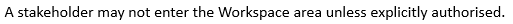

# Light World Assumption

> [!NOTE]
> **Summary:**  If you don't have a rule, people have freedom.
> [More SBVR principles for good elements of guidance](/docs/Business%20rules/Good%20elements%20of%20guidance/Good%20elements%20of%20guidance.md)

In clause 16.4.1, SBVR 1.5 explains:

“SBVR makes a 'light world’ assumption about rules. In a *light world,* anything that is not expressly prohibited is assumed permitted, and anything not expressly declared as impossible is assumed possible. Business rule practice indicates that this choice is the appropriate one for the large majority of business problems.”

People in the business are allowed to make their own decisions and use their discretion if there are no business rules that limit their freedom to act.

Contrast this with the 'dark world assumption’ in which you cannot do anything unless and until you are given explicit permission.

The ‘light world assumption’ explains why business rules (which limit freedom) are so much more frequent than advices (which explicitly state that something is possible or permitted).

## Dark areas

SBVR goes on to explain that you can create ‘dark areas’ by having business rules such as:

This rule sets up the Workspace area as a ‘dark area’ in the 'light world’: unlike other areas in the 'light world’, a stakeholder can only enter this area if there is some specific element of guidance (an advice, in this case) that takes away the prohibition.