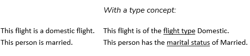
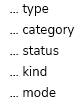
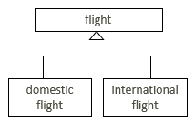
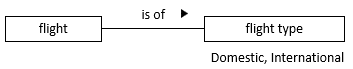
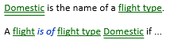
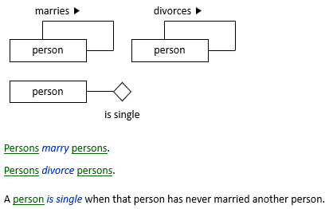
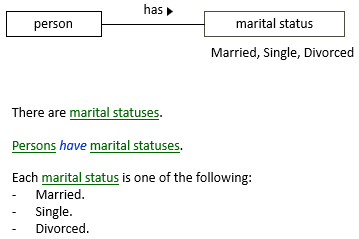
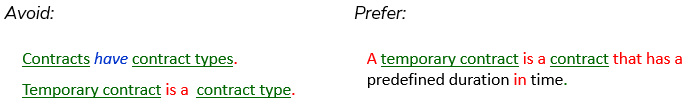

# Avoid type concepts if you can

> [!TIP]
> This tip is closely related to : [Avoid abstractions if you can](/docs/Business_rules/How_to_model_a_vocabulary_successfully/Avoid_abstractions_if_you_can.md).

Avoid modelling noun concepts that are for *types* of things rather than simply for *things.* Type concepts cannot and should not *always* be avoided, but be careful. If type concepts are unnecessary, they make your model harder to use.

*Examples*

On the left is “normal” modelling. On the right is modelling with a type concept. The sentences shown are not actually something you would enter in USoft Studio. Just appreciate the contrast between the left and the right:

Type concepts usually end in a word that talks about how something falls into a group or category, for example:

 

> [!TIP]
> In a USoft context, teams are often tempted to model type concepts because they appear also in the EAR model (the data model of the implementation). Thus, you could easily have a PERSON table with column MARITAL_STATUS based on a dropdownlist domain with Married, Single, Divorced as allowed values.
> This is not a good enough reason for a type concept on the Studio side. You can have Studio specifications without a type concept (person*is married*, see later in this blog), and link them in USoft Definer to a column for a type concept (MARITAL_STATUS). That would be perfectly legal and traceable.

## What's the problem with type concepts?

When you model noun concepts, you are already modelling *types* of object by definition - that's the whole point of the exercise. Of course you can, "on top of that”, decide to call the difference between domestic and international flights a matter of flight type. But is it really necessary, and is it even a good idea? Perhaps you also have high-risk and low-risk flights. How would that not be another case of flight type? The trouble is, you can "give away” the option of grouping flights by flight type only once in your model.

Another problem is that type concepts make your model more complex.

But perhaps the biggest problem is that you risk getting into 2 different styles of modelling in the same area. Over time, it could become very hard to see that part of your information about the area is in one corner, and another part is in a different corner. If you need to add further details later, it could become hard to decide where and how.

### Example without type concept

Without a type concept, things remain fairly simple:

A flight is the fact that an aircraft moves from one port to another.

A domestic flight is a flight of which the destination port is in the same country as the departure port.

An international flight is a flight of which the destination port is in a different country than the departure port.

Each flight is exactly one of the following:

- domestic flight
- international flight.

### Example with type concept

With a type concept, things get more complex:

A flight is the fact that an aircraft moves from one port to another.

Flights*are of*flight types.

Each flight type is exactly one of the following:

- Domestic.
- International.

A flight*is of*flight type Domestic if its destination port is in the same country as the departure port.

A flightis offlight type International if its destination port is in a different country than the departure port.

With USoft Studio, everything is optional and you don't have to go “all the way” by modelling out all the elements, but if you did, then technically the options for flight type would be individual concepts:

### Some more examples

1. Marriage example, without type concept:

2. Marriage example, with type concept:

3. When you model temporary contract as a category of contract because it unites a group of contracts that have characteristics that not all contracts have, that is already a type of contract by definition. You don't want to start talking about contract types:

## Type concepts are not always bad

If you are modelling a car rental company that has an entire way of working organised around the fact that their rental cars fall into 5 price categories (A, B, C, D, E), then you need the type concept

price category

in your model. It is the only way to account for the business reality of having this classification.

 