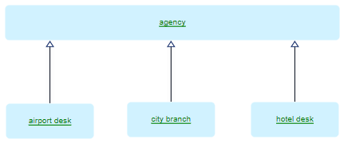

# Consider SBVR diagrams as helpful but secondary

If you take the time to formulate good business rules, definitions and concept structures, then USoft Studio will give you an extremely well-structured and navigable knowledge base.

Consider SBVR diagrams as helpful, but secondary add-ons. It is true that many people like drawing more than writing. But like it or not: good writing is better. On a positive note, rule writing is easier than document writing!

Let's briefly look at advantages and drawbacks of SBVR diagrams.

## Advantages of SBVR diagrams

Diagrams offer visualisation. Most people find concept models easier to understand and (part) memorise if they are visualised.

As a diagram author, you must make clear distinctions about how concepts relate to each other, because these choices are also drawing choices.

In USoft Studio, diagrams automatically create added navigation paths. Text used in diagrams is automatically connected to concept names in formulations and hyperlinks are supplied for diagram-to-formulation navigation. Formulation-to-diagram navigation is also partially supplied, because USoft Studio automatically shows a clickable list of diagrams where a given concept plays a role.

## Drawbacks of SBVR diagrams

When you draw, it's easy to get carried away. Don't draw more concepts than you need. Something is wrong if you find yourself with (many) concepts that don’t play a role in your business rules.

You could say that a good SBVR diagram "never hurts”, but it has to be maintained: as language specifications change, you must keep an eye on what that means for existing diagrams.

Another drawback of SBVR diagrams is that they can give a false sense of clarity and overview. If you don't draw all the important concepts that you have in a certain area, viewers of your diagram could overlook them.

Symbols can suggest the wrong thing. Arrows used for categorisation are a good example (except in [taxonomies](/docs/Business%20rules/Vocabulary%20concepts/Categories.md), where they are universally understood). If not properly instructed, people will mistake the picture below as implying that *each* agency falls into 1 of the 3 categories and that *none* of the agencies fall into more than 1 category. But in fact, the picture does not imply any of these assumptions.

 