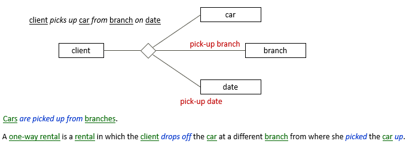

# Model reality, not data

As business is conducted on a daily basis, new clients are registered, offers are advertised, people sign contracts and send e-mails: business activity leads to communication acts and to data accumulation.

In USoft Studio, SBVR models are for business activity. EAR models are for data structure in the supporting USoft software application(s) that you create in USoft Definer. The best SBVR models are about reality and not about data.

This essay article will show the subtle differences between the two. It will give you handles for choosing the best model on both sides.

:::tip

This article is about modelling data as an *alternative* to modelling business activity. It is not about terms, definitions and rules that are simply *about* data and that you have no alternative for. There is no question that it is valid to have this rule in your model, including the concepts it uses:

:::

## SBVR models and EAR models compared

Don't feel that in your USoft Studio vocabulary (your SBVR model), you have to model everything that surfaces in your EAR data model. SBVR should help you understand and clarify what natural-language terms people use in business reality, independently of what the organisation stores in a database and how it stores it there.

This idea can be difficult to grasp when you start out, because there is such an obvious and close link between the data structure and the reality it represents.

A car renter deals with rentals. A rental is an agreement with an individual client about the rental of a specific car at a specific place during a specific time period. Imagine you have already built a first USoft prototype. Here is an EAR model showing some of the data structure you built:

When you think about rentals this way, it is tempting to create an SBVR model as in the picture below. The properties of a rental are coloured dark-red only to help you follow the discussion through to the end of this blog:

This second diagram is supposed to visualise the way that people talk about the business of rentals in natural language. This is different from the purpose of the earlier EAR diagram. On the other hand, undoubtedly, people in the business will often spontaneously phrase sentences like "… the pick-up branch of this rental ...”, which neatly corresponds to the relationship between rental and pick-up branch as visualised here. What could there possibly be against this approach?

First, as the example shows clearly, you are actually duplicating specifications: you say the same thing in two different places. In IT, this is always a potential problem, because 6 weeks from now, there will be changes, and it will be hard to remember to make them in both places.

Second, and more fundamentally, if you model in this way, all your formulations will follow the data model. You find yourself modelling verb concepts like this:

Next, you will find yourself creating further rules and definitions following this pattern:

Compare this to modelling the *activity* of people dropping off cars:

The second model is better. But *everything* you have seen in this article so far may well seem absolutely fine and clear to you… So take a moment to weigh pros and cons.

Why is modelling the activity better?

When you make decisions about concepts and terms, you are building a whole network: a structure of terms. As you can see, as soon as you start modelling natural language, a great many different words pop up, even around something so simple as clients picking up rental cars. To avoid getting lost in all these terms, you need to concentrate on what is essential. Also, you need some sort of practical *modelling principle* that you can follow, so that you are not constantly in doubt about how to write and model something. The activity ‘client*picks up*car‘ is more essential than the rest, because this is what *causes* all those other words to come into play - if clients did not pick up cars, you wouldn't need any of them.

Look at the 2 definitions of one-way rental. They are quite different. On what basis can you, as an author, choose one over the other with confidence? By understanding that it is attractive to gather information around the business activity that is at its source. You want your readers to find everything related to car pick-ups when they select client*picks up*car. The second definition does this. The first does not.

If your model just reflects your USoft tables and columns, you may as well have *has* on every line:

But *has* does not tell your readers anything. (Technically, we say it is *semantically weak.*) A rental is an agreement between car renter and client, so what does it really *mean* that an agreement "has” a client ID? Readers will understand much more readily that clients *book* rentals and that these clients *are identified by* client IDs. If you concentrate on activity, your model is more reader-friendly:

Here's a last argument for modelling activity and not data structure. Imagine there are data model changes later: the data model is extended to accommodate not just car rentals but also other trips, where perhaps cars can be picked up and dropped off from hotels, so that you decide to drop the relationship with branch. The foreign keys are renamed from “pick-up branch” and “drop-off branch” to: “pick-up location” and “drop-off location”. These changes will make the first way of modelling (with the model-based concepts and *has* on every line) unattractive on the Studio side. You will lose the connection that prompted you to invent these formulations. This will make it hard to trace what they are now saying exactly - they will probably need to be re-written.

### There is nothing wrong with "pick-up branch”

In spite of all this (and this may seem in contradiction with the argument so far...), there is nothing inherently wrong with having the term pick-up branch as a term in your vocabulary. It's a good, self-explanatory term. By all means, *add* it to the activity model (but not as a *replacement* of it) if you find that people use this term often on the workfloor, or if it keeps surfacing in business rules formulations. These are valid reasons for having this term. The fact alone that pick-up branch is a column in your database is not a good reason.

You could have:

### Simplify if possible

We used an n-ary verb concept, a "star shape”, earlier for the business activity of picking up cars.

In reality, business activities usually have an identifyable time element and place element, so if you draw everything that you can possibly think of, you end up with many n-ary verb concepts and pretty complex SBVR diagrams:

Consider drawing only what you really want to visualise. You may want to simplify by having just binary verb concepts:

Perhaps you don't need pick-up branch in any diagram at all - formulations you have about this term could be perfectly clear without the term appearing in any diagram.

### EAR attributes as roles

As you probably noticed, just mapping data attributes to independent noun concepts is unprecise. In our USoft [SBVR toolkit](/Business_rules/Vocabulary_concepts/A_minimal_toolkit_of_SBVR_vocabulary_concepts.md) we distinguish independent [noun concepts](/Business_rules/Vocabulary_concepts/Noun_concepts.md) (SBVR: *general concepts*) from noun concepts that play [roles](/Business_rules/Vocabulary_concepts/Roles.md). It does not cost you much to make the difference at the time when you draw a diagram. This distinction clarifies concepts both for you as an author, and also for your readers. The diagram choices on the right are more precise and informative:

Adding wording and cardinality may help you see the different sorts of relationships:

Be aware that you can always analyse further. Date is a good choice as the general concept behind pick-up dates, but you could be more precise and say that a calendar day**is when a car is picked up, and that a calendar day *is represented by* a date: compare:

The last example shows how "real world” concepts (such as day) and data elements (such as date) hang together. There will always be a point where you can use *is represented by.*,This is the point that marks the boundary between the "real world” and the data elements that store information about the real world. You can always analyse further. The next step could be to analyse how your team has different date formats and how these are represented by numbers and characters.

Some teams like to indicate in an SBVR diagram what corresponds to data types in USoft Definer, without going any further. This approach does not take much room in diagrams if you omit the verb concept wording:

## Descriptor concepts

Ground handlers at an airport have a code system with "handler indicators” or "HI-codes” that shows the status of each package or piece of luggage that goes through their hands:

|**Handler indicator (HI)**|**Meaning**|
|--------|--------|
|RC      |Received|
|DL      |Delivered|
|RD      |Redirected|
|M       |Missing |
|Q       |Quarantained|

In this situation, handler indicator and its synonym HI-code are *descriptor concepts*. They are noun concepts but they do not stand for actual things in reality. They just *describe* things or situations.

:::tip

Descriptor concepts are like [type concepts](/Business_rules/How_to_model_a_vocabulary_successfully/Avoid_type_concepts_if_you_can.md) in many ways, but they come into existence for slightly different reasons.

:::

Consider this for a moment. package or piece clearly stands for something physical in reality. rental ID does not stand in the same way for something physical: rental IDs are an administrative reality. But you probably cannot do without rental ID as an independent concept, because otherwise you cannot account for the system of rental IDs, which you probably don't want to miss, because it will play a big role in business rules. HI-code is one step further removed from reality, because you can alternatively describe reality without HI-codes. Indeed, you could use:

and so on. The HI-codes are mere descriptors of something that also takes place without them.

First, imagine that packages with a given sticker on them (like DL for Delivered) always roll off the same type of belt, and handlers make decisions based on where they are - what belt they are working on. The HI-codes are there as an administrative measure or a double-check in case something goes wrong, but people on the workfloor do not normally make decisions by looking at the HI-codes. This is a situation where HI-codes are merely descriptors. Prefer modelling the *activities.* Consider HI-codes as a secondary thing. This brings us back to the beginning of this blog, where we set out the advantages of modelling activity and not mere descriptors of activity.

But there is another side to this story. Now imagine that HI-codes are always clearly shown with big lettering on each piece of luggage, and there are many business rules that tell handlers what to do. These rules say they must make their decisions on the basis of what letter code they see displayed. There could even be a rule saying that if the lettering is not there, or not clearly readable, the luggage must be put to one side. This is a situation where the HI-codes play an essential part in business activity. You have to model HI-code as an independent noun concept. Different business rules will go into the consequences of seeing the various allowed values of HI-codes. The point is that you model HI-code not because the software application has a table column PIECE.HI_CODE but because HI-codes are an essential part of business activity.