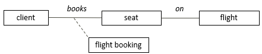
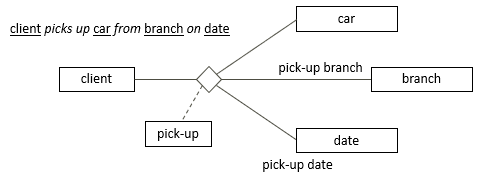
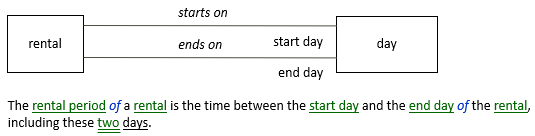
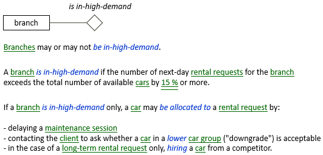
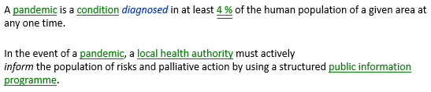

# Stepping stones

Speakers of natural language have a whole repertoire of strategies to avoid complexity and make their lives easier. As an author of business rules in natural language, you need to be especially aware of the stepping stone strategy.

## Stepping stones

You want to reach the opposite bank of a fast-flowing river. There are many obstacles: slippery pebbles, torn branches, rapids and deep waters, alligators. But there are *stepping stones* that you either discover or that you organise yourself. With a stepping stone, many obstacles fall away. Many things become simpler just because of 1 thing in the right place that gives you a foothold.

There is a mechanism in natural language that is a little like a stepping stone. It's the fact that 1 noun concept can function as a placeholder or umbrella term for a whole structure of interrelated things. Instead of making long sentences and wording all those things, you can just name the placeholder: the stepping stone that makes everything easier.

*Example 1*

flight booking in:

This is a [nominalisation](/Business_rules/Vocabulary_concepts/Nominalisations.md).

*Example 2*

pick-up in:

This is also a nominalisation.

*Example 3*

rental period in:

This is a placeholder for an entire structure of other terms, not just for 1 verb concept (as in *Example 1* and *Example 2*).

*Example 4*

A car renter has a subsystem of business rules that apply in a defined situation of high demand, and only then. You could have the [unary verb concept](/Business_rules/Vocabulary_concepts/Unary_verb_concepts.md) ‘branch*is in-high-demand*’ as a stepping stone so that it is much easier to formulate all those rules.

In this example, only 1 rule is shown, but the strategy becomes more interesting with every additional “high demand rule”:

:::tip

The hyphens in "in-high-demand” make it possible for USoft Studio to recognise these words as a unary fact type. The USoft product roadmap contains the wish to make these hyphens unnecessary.

:::

*Example 5*

Essentially the same "stepping stone” mechanism can also be observed for pandemic in the following example. The definition makes it much easier to formulate the rules.

:::tip

pandemic shows the "stepping stone” mechanism, but it's also simply too artificial to talk about pandemics without having pandemic.

:::

## Stepping stones - what do they mean for you?

As a business rules author, use stepping stones. They make your own life easier. It is natural and unproblematic that part of your meaning is "hidden behind” a stepping stone. USoft Studio is very good at creating automatic reader navigation from a stepping stone to its meaning, via hyperlinks and hover pop-ups.

Make sure that you rely on this navigation. You don't want to repeat the "4 % rule” in Example 5 anywhere else than in the definition of pandemic.