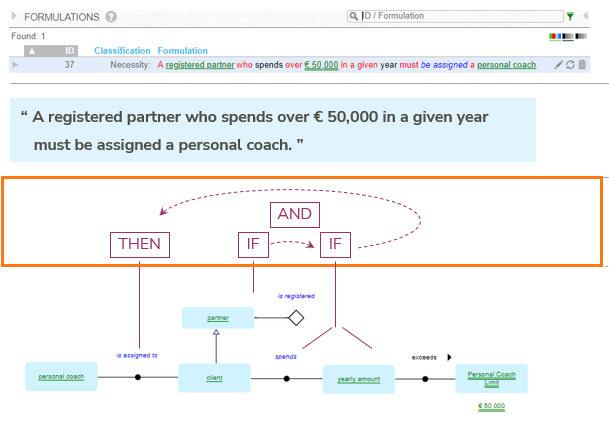
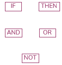
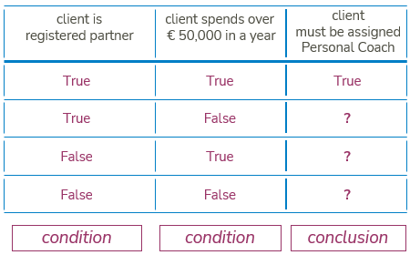
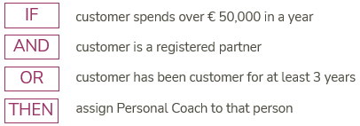

# Business rules have logical structure

A business rule does not only use colour-coded concepts that exist in a concept structure.

A business rule is also a logical proposition. It has logical structure.

When you work in USoft Studio, you need to be aware of various different levels of specification.

In the picture, the concept structure is depicted at the bottom. The logical structure is one level higher and highlighted by the orange box.

Concept structure and logical structure together determine the meaning of the rule, but they are both *underlying* structures: it is not what you see at the surface. What we see at the surface is just an English sentence, except that concept structure is reflected in colour-coding in the USoft Studio tool (topmost layer).

English has words that mark logical structure. The 5 chief markers of logical structure are:

These words can also appear at the surface of a business rule. But the example clearly shows that natural language has many other ways to express logical structure. In the language sentence (at the second level from the top), **none** of the marker words is visible but a logical structure is still there. Readers and developers need to interpret the language of a rule statement to find out what the logical structure is:

As you can see from this example, a rule has *clauses:* conditions and a conclusion. A rule has exactly 1 conclusion. It can have any number of conditions, logically connected by AND or OR. The conclusion is fairly easy to find in a language statement because:

- If "must” or “may” is used, the clause that has "must” or "may” is the clause that has the conclusion.
- The conclusion is the clause that has the grammatical *main verb*. Here, the main verb is "assigned”. There is another verb at the surface, “spends”, but this verb is not in the main clause. It is in a subordinate clause. Clauses introduced by relative pronouns (here, "who”) are subordinate clauses.

This example also shows that conditions can be hidden in single words. The words "registered partner” hide a condition: “If a partner is registered...”.

If you draw a decision table, you can clearly see what the rule claims and what it does not claim:

Clients are either registered partners or not. They either spend € 50,000 a year or not. These two switches together create 4 possible situations, visible as the 4 rows of the decision table.

The rule has something to say about situation number 1 but it does not imply anything about the other 3 situations. On the basis of SBVR’s Light World Assumption, the conclusion in the other 3 situations must be that a client does not need to be assigned a personal coach if no further rules exist to the contrary. You can replace the 3 question marks by "False”.

## Logical connectors

If you have multiple conditions, they are logically connected by either AND or OR. When you have a mix of AND and OR, the rule must be clear about the intended structure. Here is a mix of AND and OR that is not clear:

**“A customer who spends over € 50,000 in a given year and is a registered partner or has been a customer for at least 3 years must be assigned a personal coach.”**

The unclarity is caused by the fact that you have AND and OR at the same level. This can be visualised as:

This is, of course, a trivial source of confusion that most everyone in the IT industry is aware of, and that can be summarised as:

but the point here is that this must avoided also if the logic is half-hidden in all manner of natural-language constructs. The unclarity can be lifted by being more explicit about the levels at which the AND and OR connectors are related:

So you need to formulate (for example):

 

**“A client must be assigned a personal coach if:**

**- he spends over € 50,000 in a year, or**

**- he is a registered partner who has been customer for at least 3 years.”**

 

**"A client must be assigned a personal coach if he spends over € 50,000 in a year and:**

**- he is a registered partner, or**

**- he has been customer for at least 3 years.”**

 

> [!TIP]
> If structures become more complex, it it increasingly attractive to talk about the logical connectors explicitly. You can introduce the bulleted lists with phrases like “**if all of the following apply:**”, "**if at least one of the following applies:**”.
> Keep the rule format simple. Simple bulleted lists are fine, but you should avoid multiple different levels of bullets (as found in Powerpoint slides). You can keep lists simply by splitting rules if necessary.