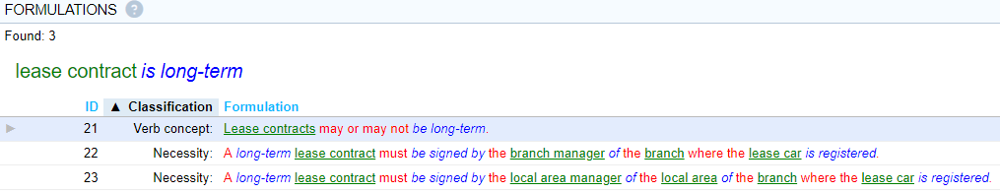
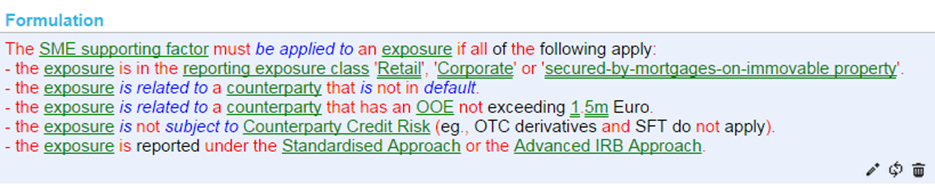
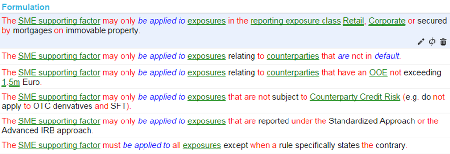

# Split into 2 rules or combine into 1 rule?

Rules in a body of shared guidance are supposed to be silently connected by a universal AND.

As a consequence, if conditions are separated by AND at the highest level, you effectively have 2 logical rules rolled into 1 language statement.

You can split this into 2 rules without changing or losing meaning:

Should you split or combine? There is a trade-off here. Split rules are shorter and easier to read. Combined rules can make it easier to see at a glance what the preconditions are for a specific situation to apply:

Notice that the second condition build on the first ("that branch”). This seems a further argument for combining them in 1 rule. But also notice that USoft Studio will automatically present the 2 rules when they both need to be visible:

 

Here is another example where you have this trade-off:

If there are *many* conditions and they are needed only in 1 place, combining them into 1 rule is a lot less work and makes for easier reading:

Compare to:

 