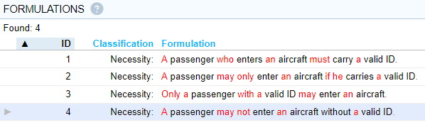
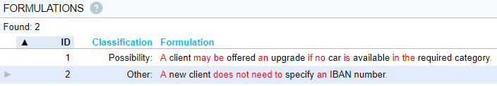

# A business rules primer

## Business rules

A **business rule** expresses a necessity or obligation. A business rule always takes away some freedom that people in the business would otherwise have.

A business rule contains a *business rule keyword*. Here are business rule keywords that USoft prefers:

| **Business rule keywords (preferred)** |   |   |
|:--------------------------------------:|---|---|
| **must**  **must not**               | **may not** | **may … only** |

**Must** is usually suitable. If you need a negation, combine it with **not** (**must not**).

**May** expresses necessity or obligation only if combined with either **not** or **only**. **Only** can appear earlier or later in the sentence than **may**, and other words can appear between the two.

:::warning

**May not** in English can also mean "perhaps does not always”. This can be a drawback of this word combination.

:::

*Examples*

These examples show that USoft Studio automatically provides **Necessity:** captions to the left of business rules:

The last example is not the best choice. It is harder to read than the others because of the double negative (**not** and **without**).

## Advices

An **advice** expresses a possibility or permission. It says that some course of action is open. It never takes away any freedom.

An advice contains an *advice keyword.* Here are advice keywords that USoft prefers:

| **Advice keywords (preferred)**      |   |
|--------------------------------------|---|
| **may**(without **not** and without **only**) | **does not need to** |

Make sure that in combination with **may**, you do not also use **not** or **only**, or else the statement will turn into a business rule instead.

So, you cannot use **not** to express that people have the option to *not* do something. But you can use **does not need to.**

*Examples*

The top example shows that USoft Studio automatically provides the **Possibility:** caption to the left of advices.

The bottom example shows that the caption for **does not need to** is: **Other:**

## Alternative keywords

Natural language offers a wealth of alternatives to the preferred keywords in this article. We find there is never a really good reason to use other keywords. *Should* is popular, especially with British speakers, as a milder alternative to *must*, but in a collection of business rules, *should* can introduce uncertainty or polite vagueness.

The following keywords can be of service, and are also recognised by USoft Studio as business rules keywords:

### Alternative keywords

|                          |                          |
|--------------------------|--------------------------|
| it is necessary that     | it is not necessary that |
| it is obligatory that    | it is not obligatory that|
| it is possible that      | it is not possible that  |
| it is permitted that     | it is not permitted that |
