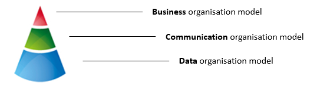
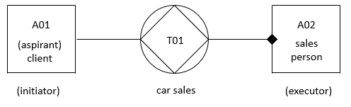
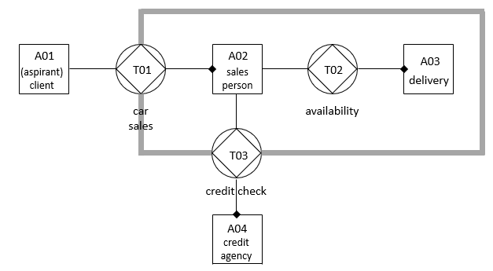
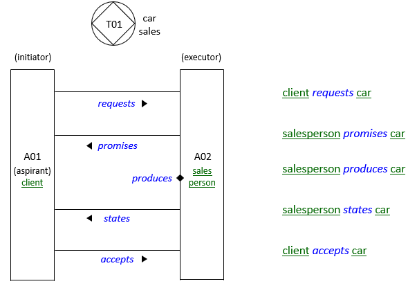

# Enterprise Ontology

Enterprise Ontology is a comprehensive framework for understanding human organisations as organisms. It offers clear principles for business modelling. Dr. Jan L.G. Dietz published a seminal book on Enterprise Ontology in 2006. More recent publications incorporate later developments particularly at the TU Delft university in the Netherlands and around the DEMO group ("enterprise engineering", www.demo.nl), for example Dietz, Jan L.G., *Enterprise Ontology. Theory and Methodology,* Springer 2010, and Dietz, Jan L.G. and Hans B. F. Mulder, *Enterprise Ontology. A Human-Centric Approach to Understanding the Essence of Organisation*, Springer 2020.

## Transactions

This theory incorporates results from earlier theories and models, such as object-fact modelling, but also introduces extremely useful concepts not found elsewhere, in particular, the idea that all business activity is ultimately the result of **transactions** taking place between people who need something from other people.

A transaction takes place when you want to buy a car, and a dealer can provide the car. This gives rise to a transaction between yourself and a salesperson. The salesperson requires a further internal transaction between himself and someone from Delivery, so that the car is actually made available and can be promised to you. The salesperson may need to check your creditworthiness: this could require a transaction between the salesperson and a national credit registration bureau or credit agency. Scroll down to see a picture of this example.

This network of interdependent transactions is summarised by the term of *business organisation.* It involves clusters of requirements, promises, actual delivery and acceptance, and maybe also less happy paths such as cancellation. Business organisation requires all manner of supporting communication activities and digital systems such as websites that allow registration and e-mail messaging. This *communication organisation* is a second layer. Communication leads to *data* about the transactions. This gives rise to a further layer, *data organisation.* Transaction activities are few but essential. Communication activities take more time but are less essential. Large quantities of data accumulate in the background. A cone-shaped figure visualises this:

## Actor Transaction Diagrams

Enterprise Ontology is a comprehensive theory that uses a variety of diagram types. The most characteristic diagram type is the Actor Transaction Diagram. It shows transactions between actors. One actor is the initiator and the other is the executor. The executor side is identified by a black diamond:

Actor Transaction Diagrams visualise how transactions depend on each other. The organisation is seen as an organism that has an internal structure and an external surrounding. In the following example, the Delivery department is internal, but the customer and the credit agency are external to the organism. The boundaries of the organism are represented by thick lines. Transactions with external parties cross the line:

## Transaction patterns

Enterprise Ontology recognises recurrent patterns that are found in each human transaction. A transaction with a happy path involves patterns of requiring, promising, producing, stating and accepting the transaction, each time with a clear role division between the two parties. Unhappy paths such as cancallation are different, but they equally show predictable patterns.

The activities or steps in these patterns are closely related to the verb concepts represented in blue italic lettering in SBVR and USoft Studio:

## What USoft borrows from Enterprise Ontology

Enterprise Ontology suggests that you create *aspect models* of 4 interrelated types:

- Transaction model
- Process model
- Rules model
- Object-fact model

Transactions are a heuristic principle in USoft projects: you can use the idea in your head to see patterns in complex businesses. An airport has hundreds of business rules, and tenths of business processes, but if you look at its top-level transactions, you get an overview that is a structure of perhaps no more than twenty or thirty transaction types. In USoft Studio, you can draw Actor Transaction Diagrams (this requires a separate license). USoft Studio automatically colour-codes any text that you use in these diagrams. It provides automatic pop-up definitions of terms and implements navigation to business rules and definitions. It also implements automatic navigation from concepts to Actor Transcation Diagrams where these concepts appear.

Enterprise Ontology's remaining 3 aspect models map more directly to the foundation of the USoft platform. As the USoft Approach makes clear, the USoft platform is built on the three layers of Structure (shaped and reflected in relational data structure), Rules, and Interfaces. Structure maps directly to object-fact models. Rules map directly to rules models. Processes dictate workflow structures, APIs and UIs, all of which map to USoft's Interfaces.

Of course, USoft is different from Enterprise Ontology because, ultimately, its aim is software manufacturing rather than business modelling. This is particularly visible when you look at the role of data structure. In Enterprise Ontology, data structure is not essential: data organisation is seen as a by-product of transactions. In USoft, data structure is essential: it is the cornerstone of the Structure-Rule-Interface layers of a USoft software application.