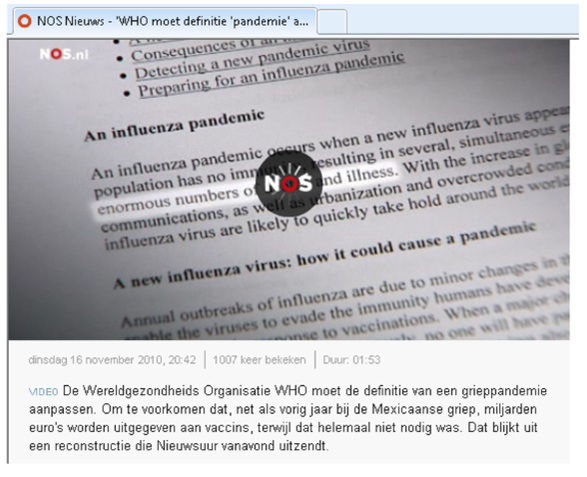
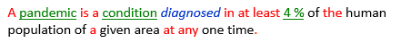

# Rules and definitions are interrelated

In 2012, long before the 2020 Covid crisis, a Dutch public network published the following item:

"The World Health Organisation (WHO) has had to adjust its definition of 'influenza pandemic'. This was to prevent that, in the same way as last year with the 'Mexican influenza', billions of euros are spent on public vaccination programmes, when it was found that this expense was not really necessary."

This example illustrates the importance of definitions in practice. The WHO probably had some business rule comparable to:

In this business rule, the meaning of *pandemic* is crucial. The WHO must have had some *definition* of pandemic, such as perhaps:

The rule is critically dependent on the definition. USoft Studio is a great help with managing this kind of semantics. It places rules and definitions in the same box. This allows you to get automatic colour-coding, automatic pop-up definition texts, and automatic hyperlink navigation between rules and definitions.

It is not really possible to work with business rules if you do not work with quality definitions in parallel. To see this, try to word the rule WITHOUT using 'pandemic'. The rule could look like this:

But this is not really an alternative. You cannot do without definitions for long:

- The rule becomes long and difficult to read.
- If there are multiple different rules about what must happen in the event of a pandemic, you have to repeat the pandemic criteria (the '4 % rule') in each of those rules. This will quickly turn your rulebase into a maintenance nightmare.
- People in the field of healthcare actually *use* the word 'pandemic' all the time. It is unnatural and user-unfriendly to ban this word.