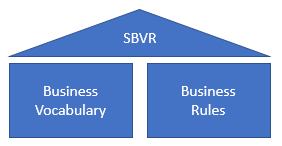
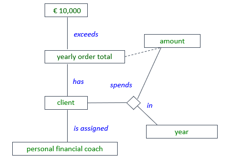

# Semantics of Business Vocabulary and Rules (SBVR)

Semantics of Business Vocabulary and Rules (SBVR) is a [formal specification](https://www.omg.org/spec/SBVR) by Object Management Group. It was first published in January 2008 and reached version 1.5 in December 2019.

SBVR is a comprehensive conceptual schema (or "meta-model") for understanding what business rules are and how the meanings they express may be articulated and formalised. SBVR uses logical and linguistic theory as well as insights from business organisation.

As its title expresses clearly, SBVR has two closely interrelated subjects: business rules and business vocabulary.

This idea was not new in 2008. It had many forerunners, including Object Role Modelling (ORM), Natural language Information Analysis Method (NIAM), Fully Communication-oriented Information Modelling (FCO-IM), and Ronald Ross' work in business rule typology and controlled natural language, part published as Rulespeak at [www.rulespeak.com](https://www.rulespeak.com/en/). Summaries and commentaries have followed SBVR (Witt, Graham, *Writing Effective Business Rules. A Practical Method,* Morgan Kaufmann 2012; van Haarst, Rob, *SBVR Made Easy,* www.conceptualheaven.com, 2012).

SBVR is particularly successful in articulating the relationship between its 2 pillars, business vocabulary and business rules:

'Business vocabulary' is the conceptual schema of terms and definitions that underlie your business rules. These terms and definitions are important for determining what the rules really mean. The meaning of the business rule:

depends partly on an underlying concept structure, represented here by green noun concepts and blue verb concepts:

The point of this example is not the detailed choices that have been made here in modelling the concepts of this particular rule. The point is to illustrate the general idea of "underlying conceptual network”.

Meaning comes partly from the understood or stated *definition* of what each term means. Definitions may or may not be trivial. You probably do not need to define what is meant by "€ 10,000". On the other hand, "assigned" may require a definition here, or it may require additional rules, or both. A definition could be:

“ 'Customer* is assigned*personal financial coach' means that the services of the personal financial coach have been proposed to the customer and accepted by her, and that the relationship has been registered.”

Also, it seems useful to give a definition of personal financial coach: what kind of services does such a person offer? What sets her apart from other professionals, how is she qualified to do this?

## The added value of SBVR

Even if many people understand the value of terms, definitions and business rules, the value of SBVR is often misunderstood. The biggest problem SBVR seems to have is that it is not immediately clear how it contributes to commercial success.

SBVR tries to demonstrate concrete added value by prescribing an (XMI) format for metadata exchange between tools and databases, but complying to this format is very hard work. This format does not seem to have evolved into a practice shared by many parties in the industry.

To USoft, SBVR has proven its practical value, but at a different level. We find that, without a formal specification, too much time and effort is spent discussing and deciding what exactly a business rule *is;* what makes it different from other rules and other types of specification; how concept structure must be understood; and how all this is best supported by software tooling.

## Does USoft support SBVR?

OMG specifications like SBVR prescribe compliance points for those wishing to claim they support the standard. USoft does not comply with SBVR on these formal points, but at the same time, USoft Studio is based entirely on SBVR. All the core concepts implemented by USoft in USoft Studio are SBVR concepts. SBVR has generally been the inspiration behind the entire initiative.

Ironically, USoft has gone furthest in the areas that SBVR is *not* normative (only informative) in: the text colour-coding that many consider to be the most characteristic hallmark of SBVR, and the SBVR diagramming technique (a subset of UML diagramming).

USoft heavily relies on SBVR's idea of concept structure for automatic presentation and navigation of business rules in the tool interface. It automatically presents all the rules that use a given concept, and provides automatic navigation to neighbouring concepts and rules.

## Getting started with SBVR

The best way to start with SBVR is in USoft Studio. A wealth of (mainly PDF-formatted) information is supplied in the tool itself, including how-to and best-practice information but also underlying theory. Click Help in the header bar, or click on the options in the Help tile of the Home page.

 