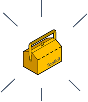

# A minimal toolkit of SBVR vocabulary concepts

This section of USoft Community presents a carefully selected, small but powerful toolkit of SBVR concepts that you can use to model a business vocabulary for the benefit of a USoft project.

> [!TIP]
> SBVR is an extensive specification. It presents hundreds of concepts in a document that contains hundreds of pages. The USoft toolkit contains just 11 concepts. Go to [www.omg.org](http://www.omg.org) for a free copy of the official SBVR specification.

 

Here are the names of the 11 concepts that USoft practitioners use most often:

|        |        |
|--------|--------|
|[Noun concepts](/docs/Business_rules/Vocabulary_concepts/Noun_concepts.md)|[Roles](/docs/Business_rules/Vocabulary_concepts/Roles.md)|
|        |[Nominalisations](/docs/Business_rules/Vocabulary_concepts/Nominalisations.md)|
|[Binary verb concepts](/docs/Business_rules/Vocabulary_concepts/Binary_verb_concepts.md)|        |
|[Unary verb concepts](/docs/Business_rules/Vocabulary_concepts/Unary_verb_concepts.md)|        |
|[N-ary verb concepts](/docs/Business_rules/Vocabulary_concepts/Nary_verb_concepts.md)|[Synonyms](/docs/Business_rules/Vocabulary_concepts/Synonyms.md)|
|        |[Categories](/docs/Business_rules/Vocabulary_concepts/Categories.md)|
|        |[Segmentations](/docs/Business_rules/Vocabulary_concepts/Categories.md)|
|[Individual concepts](/docs/Business_rules/Vocabulary_concepts/Individual_concepts.md)|        |
|[Examples, instances](/docs/Business_rules/Vocabulary_concepts/Examples_instances.md)|        |

text-align:center; 

As we will see, even in this minimal toolkit, some concepts are much more central than others.

**Noun concepts** and **binary verb concepts** are absolutely crucial: you need to know how to model these yourself. The same is probably true for **categories.** 

Other concepts must be part of your repertoire simply because they help you understand it. Even if you don't create explicit **Individual concepts**, **Examples** or **Roles** all the time, understanding what they are provides background knowledge that you really need in order to understand the modelling system as a whole.