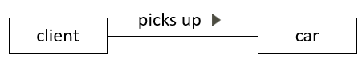
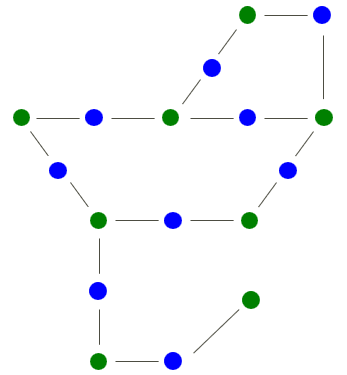
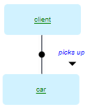

# Binary verb concepts

:::note

**See also:** [A minimal toolkit of SBVR vocabulary concepts](/Business_rules/Vocabulary_concepts/A_minimal_toolkit_of_SBVR_vocabulary_concepts.md)

:::

 

*Naming, colour-coding:*

*SBVR, graphism:*

*USoft Studio, graphism:*

*USoft Studio, declaration pattern:*

## About binary verb concepts

### Binary verb concepts are key

In SBVR and in USoft Studio, noun concepts and binary verb concepts will be the key ingredients of your concept network. Noun concepts (colour-coded in **green**) exist because they play a role in binary verb concepts (colour-coded in **blue**). Binary verb concepts connect noun concepts, so they are the backbone of the structure:

Other concept types are nice-to-know but, compared to noun concepts and binary verb concepts, they are all of secondary importance.

### USoft Studio: Use plurals to introduce a binary verb concept

In USoft Studio, the declaration pattern for binary verb concepts is noun - verb - noun - full stop:

Clients*pick up*cars.

Persons*work for*organisations.

As you can see, the nouns appear typically in the plural. The plurals express that you are not talking about any *particular* client or car. They leave unspecified how many clients and how many cars. They don't suggest that *every* client in the system must eventually pick up a car. This could well be a business rule but that rule would have to be added in a separate formulation. The plurals even allow that no**client has as yet picked up any car at all (but there may be in the future). The intent is "Clients pick up cars - it happens”, like someone describing the cruelty of nature might say "Cats kill birds”.

This pattern just declares the binary verb concept. It does not *define* it. If you want to provide a definition, you need to do that in a separate sentence. Make sure you mention both the nouns but not the verb in your explanation. USoft recommends using the words "applies when”. You can simply add the definition to the formulation as a second sentence (after the first full stop):

Persons*work for*organisations. This applies when the person has signed a fixed or temporary labour contract with the organisation.

or if you prefer, you can have the definition as a separate formulation.

### Diagramming options

The small black arrow by the verb concept wording, the *reading pointer*, helps readers of your diagram see immediately the direction of reading the noun - verb - noun sequence. This is helpful because in an SBVR diagram, the "second” noun may be placed anywhere relative to the "first” noun, for example below instead of to the right:

or above, or even to the left. If the reading direction is normal left-to-right, you could consider dropping the small arrow. If you are most interested in a role name as the property of a noun, you could consider dropping the verb concept wording altogether:

 