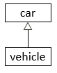
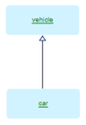
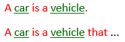
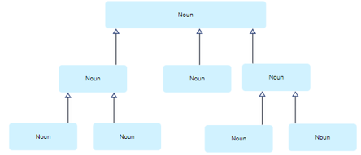
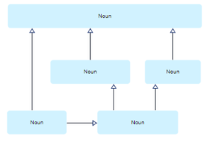
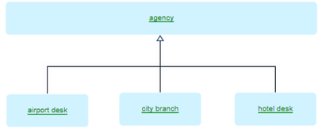
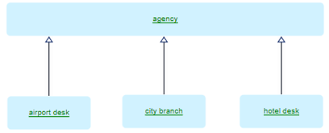
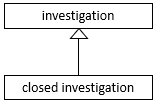
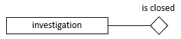

# Categories

:::note

**See also:** [A minimal toolkit of SBVR vocabulary concepts](/docs/Business_rules/Vocabulary_concepts/A_minimal_toolkit_of_SBVR_vocabulary_concepts.md)

:::

 

*Naming, colour-coding:*

*SBVR, graphism:*

*USoft Studio, graphism:*

*USoft Studio, declaration patterns:*

## About categories

### Categories and more general concepts

A category is a "special case” of another noun concept, its *more general concept.*

Cars are a category of vehicles. They have all the properties of vehicles, such as being a means of transport and perhaps having wheels. In addition, they have properties of their own, such as being motorised, having 4 wheels, and being primarily intended for the transport of persons.

Instances of a category have all the properties that instances of its more general concept have, and in addition, one or more special properties of their own. These special properties cause them to be instances not just of the more general concept but also of the category.

### Taxonomies

A **taxonomy** is a structure where each category has exactly 1 more general concept:

You can also have structures of categories that are not taxonomies. Categories in such structures have multiple more general concepts:

### Segmentations

A **segmentation** is a structure where where each instance of a more general concept falls in exactly 1 of multiple categories. You can indicate a segmentation in a diagram by a single arrow line with a split base, rather than individual arrow lines:

Diagrams have only informative, accessory status. Make sure you also formulate a structural rule:

**“Each agency is exactly one of the following:**

**- airport desk**

**- city branch**

**- hotel desk.”**

Please note that the following diagram perhaps *suggests* a segmentation to many readers, but does not imply anything about the way in which agencies fall into the 3 categories:

### Contrast categories with unary verb concepts

Categories are for collections of *innate* properties: characteristics that instances have all the time. Contrast with unary verb concepts. Do not model:

Instead, model:

### Do not over-model categories

Do not get into the habit of distinguishing intricate structures of categorisation if this not essential for your purpose, which in USoft is often to achieve a software application that is fit for purpose.

Categories seem to give a sense of clarity, especially in their diagram form, but in reality they are likely to introduce unnecessary complexity.