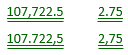
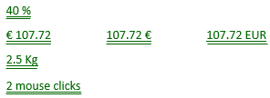
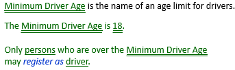
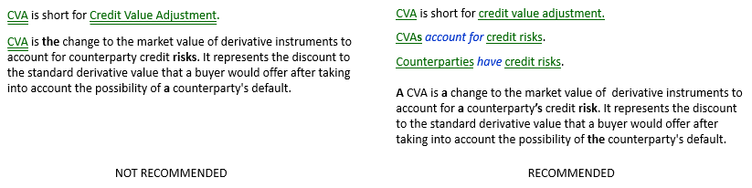

# Individual concepts

:::note

**See also:** [A minimal toolkit of SBVR vocabulary concepts](/Business_rules/Vocabulary_concepts/A_minimal_toolkit_of_SBVR_vocabulary_concepts.md)

:::

 

*Naming, colour-coding:*

*SBVR, graphism:*

*USoft Studio, graphism:*

*USoft Studio, declaration pattern:*

## About individual concepts

An individual concept is a noun concept that corresponds to only 1 instance in reality. Individual concepts are "special”: your model will contain many regular noun concepts, and only a few individual concepts. Still, they are not unimportant. Your model is easier to read and understand if you recognise individual concepts for what they are.

In English and Dutch, individual concepts are usually spelled with one or more capital letters, but you cannot recognise them by the capital letters. Regular noun concepts are usually spelled all-lowercase (apart from capitals marking the first letter of a sentence), but not always: Gold Card customer.

Individual concepts don't have a plural, but you cannot recognise them by this fact either. Regular noun concepts that are for substances, fabrics, abstractions… also don't have a plural: electricity, wool, availability.

Mathematical numbers are individual concepts:

Combinations of a number and a unit of measurement are individual concepts:

Indications of date and time are individual concepts:

Names of institutions, geographical and political entities, and individual persons are individual concepts:

You can have a constant in a business rule:

Alternatively, you can name the constant, and use the name in the business rule:

If a vocabulary is for a single community, and they have 1 Advisory Board, it may be appropriate to model:

If a vocabulary is for a government body formulating rules about advisory boards in companies, it may be more appropriate to model:

Likewise, if a vocabulary is for proceedings within a single country, it may be appropriate to have:

If a vocabulary deals with multiple nation states, each with their own high VAT percentage, you need:

In banking, many noun concepts are for subtotal amounts calculated for a specific purpose. If you can, you should tie these subtotals to *cases*, for example: counterparties or contracts, because this allows you to see them as regular noun concepts. This allows you to write business rules more successfully, as explained here. Don't conceptualise an abstraction (below on the left). Instead, conceptualise a regular noun concept that applies to multiple cases (below on the right). The words in bold show the (often subtle) differences in the wording of definitions prompted by these model differences:

 