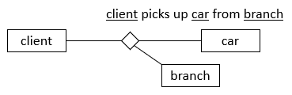
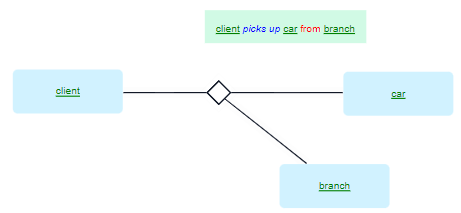
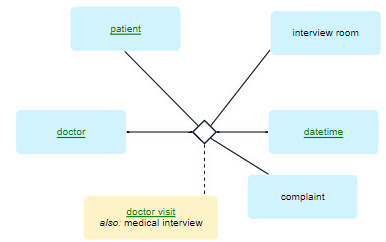

# N-ary verb concepts

> [!NOTE]
> **See also:** [A minimal toolkit of SBVR vocabulary concepts](/docs/Business%20rules/Vocabulary%20concepts/A%20minimal%20toolkit%20of%20SBVR%20vocabulary%20concepts.md)

 

*Naming, colour-coding:*

*SBVR, graphism:*

*USoft Studio, graphism:*

*USoft Studio, declaration pattern:*

There are no specific declaration patterns that allow USoft Studio to understand that you are creating an n-ary verb concept.

## About n-ary verb concepts

### N-ary verb concepts usually map to events

When you look into an n-ary verb concept, you usually find one noun that talks about *time,* and another noun that talks about *place.* In the example, *branch* is the place where the pick-up happens; you could add the time in an additional 'datetime’ noun and have 4 instead of 3 nouns involved.

The fact that so many n-ary verb concepts involve places and times shows that n-ary verb concepts map to *events:* actualities that happen in the business at a given time and place, activities that you can often schedule ahead of time.

### Avoid n-ary verb concepts as a primary means of structuring your model

Perhaps surprisingly, USoft recommends you **avoid** using n-ary verb concepts as an important ingredient in your model. Instead, use n-ary verb concepts heuristically, that is to say: be aware of the idea at times when you are trying to understand and analyse complex business realities. When proceeding to write the colour-coded formulations in USoft Studio, try to bring this reality back to the simpler binary verb concepts.

Why? One reason is practical. There are so many different ways in natural language that people word (parts of) n-ary verb concepts that the USoft language engine is simply not advanced enough to recognise them all. Another reason is linguistic. When people formulate, they string together nouns and verbs in linear sentences that flow "from left to right” on a timeline. This is a very suitable strategy for talking about binary verb concepts, but speakers cannot really express the star-shape of n-ary verb concepts in this way: they naturally break it up and talk about one of the noun-verb connections after the other.

Instead of the n-ary verb concept, consider having multiple binary verb concepts:

Clients*pick up*cars.

With this verb concept alone, USoft Studio is powerful enough to recognise it even if you talk about the branches rather than the clients, as in:

When acar*is picked up*from a branch that ...

But of course it is also possible to explicitly add the verb concept connecting the cars to the branches:

Cars*are picked up*frombranches.

When acar*is picked up*from abranchthat ...

There are cases where you could have a nominalisation for the n-ary verb concept and then use it to formulate binary verb concepts:

Doctors*carry out*doctor visits.

Patients*have*doctor visits.

Doctor visits*occur at*datetimes.

