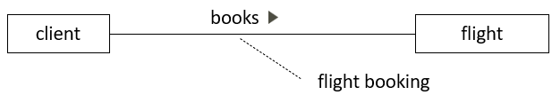
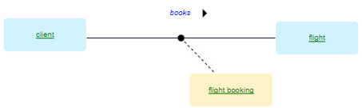

# Nominalisations

> [!NOTE]
> **See also:** [A minimal toolkit of SBVR vocabulary concepts](/docs/Business%20rules/Vocabulary%20concepts/A%20minimal%20toolkit%20of%20SBVR%20vocabulary%20concepts.md)

 

*Naming, colour-coding:*

*SBVR, graphism:*

*USoft Studio, graphism:*

*USoft Studio, declaration pattern:*

There are no specific declaration patterns that allow USoft Studio to understand that you are creating a nominalisation rather than a regular noun concept (a so-called *general concept*). Below is just a suggestion for you can use to create a nominalisation.

## About nominalisations

A nominalisation is an "umbrella term” for a verb concept. It does not have a definition of its own: its meaning is the meaning of the verb concept.

Nominalisation is a helpful idea to keep in mind at times when you are making sense of a business reality, because it is valuable to realise that a noun concept you come across actually has the exact meaning of a verb concept.

When you need to talk about the connections that verb concepts make, your writing can be shorter and easier to understand if you talk about the nominalisation rather than the verb concept. The downside is that readers have to "click through” to find out that the umbrella concept is actually "hiding” the verb concept.

A nominalisation is a [stepping stone](/docs/Business%20rules/How%20to%20model%20a%20vocabulary%20successfully/Stepping%20stones.md).