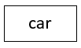
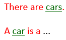

# Noun concepts

> [!NOTE]
> **See also:** [A minimal toolkit of SBVR vocabulary concepts](/docs/Business%20rules/Vocabulary%20concepts/A%20minimal%20toolkit%20of%20SBVR%20vocabulary%20concepts.md)

 

*Naming, colour-coding:*

*SBVR, graphism:*

*USoft Studio, graphism:*

*USoft Studio, declaration patterns:*

## About noun concepts

Noun concepts classify things, people, objects, but also abstract ideas such as 'eligibility’ on the basis of their common characteristics in reality.

When we look around in a car park, it is only because we have a concept car that we are able to tell cars apart from other vehicles such as vans and motorcycles.

Noun concepts seem the cornerstone of modelling, but in SBVR and related modelling theory, more than things, *states of affairs* are central. States of affairs come about because of actions, events, transactions taking place. It's only because a car renter *rents out* cars that the cars become relevant to its model. Noun concepts are important, but binary verb concepts are crucial.