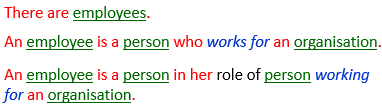
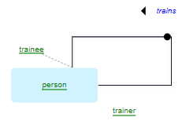

# Roles

:::note

**See also:** [A minimal toolkit of SBVR vocabulary concepts](/Business_rules/Vocabulary_concepts/A_minimal_toolkit_of_SBVR_vocabulary_concepts.md)

:::

:::warning

This article is about **role** as a concept in SBVR conceptual modelling and USoft Studio diagramming. This is completely different from **role** in USoft Definer and USoft Authorizer as an authorisation concept in USoft implementations.

:::

*Naming, colour-coding:* 

*SBVR, graphism:*

*USoft Studio, graphism:*

(free-floating role names:)

(role names connected to the line end by a dotted line:)

(role box:)

*USoft Studio, declaration patterns:* 

There are no specific declaration patterns that allow USoft Studio to understand that you are creating a role rather than a regular noun concept (a so-called *general concept*). Below are just 3 suggestions for formulations you can use when creating a role.

## About roles

### General concepts vs. roles

A role is a noun concept that corresponds to things based on their playing a part in a verb concept. Person in the example is a *general concept,* but employee is a *role* because it is based on persons playing a part in labour contracts. It is about people playing a role in the verb concept ‘person*works for*company’. Unlike general concepts, roles are an integral part of the binary verb concept they belong to.

:::note

USoft usually just talks about "(regular) noun concepts”, but SBVR is specific: a *general concept* is a noun concept that is not a role and not an individual concept.

:::

A role does not have a definition of its own. Its meaning depends completely on the meaning of the verb concept it belongs to.

### Do you really need to make the distinction?

In a USoft context, the distinction betweeen general concept and role can appear tenuous. Compare Example 1 and Example 2.

*Example 1*

*Example 2*

Practitioners on USoft projects can have a tendancy to model Example 2, which is close to data modelling. Example 1 is more correct from a business modelling point of view. There is a practical trade-off, because USoft Studio is not yet able to recognise an occurrence of the verb concept in rule formulations such as "… a person's date of birth ...”. This is a shortcoming of the toolware, because linguistically, this is automatable. It is derivable that this formulation is an occurrence of the verb concept not just of Example 1 but also of Example 2.

The role concept is also helpful to keep in mind at times when you are making sense of a business reality. In the following case, booker could become the name of your foreign key column in the relationship:

If making a booking is exactly what a person turns into a client, then model:

Some noun concepts fit the role concept like a glove: trainer and trainee in:

### Categories vs. roles

At a tour operator, if bookers are persons in their role of persons booking tours (that is: if *that* is what distinguishes them from non-booker persons), then model a role and not a category, even if it is true that bookers are a subset of persons:

 