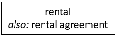

# Synonyms

> [!NOTE]
> **See also:** [A minimal toolkit of SBVR vocabulary concepts](/docs/Business%20rules/Vocabulary%20concepts/A%20minimal%20toolkit%20of%20SBVR%20vocabulary%20concepts.md)

 

*Naming, colour-coding:*

*SBVR, graphism:*

*USoft Studio, graphism:*

*USoft Studio, declaration patterns:*

## About synonyms

### Synonyms are a good idea

Synonyms (2 terms, 1 meaning) are a business reality. It can be really helpful to an organisation to clearly establish that rental is short for rental agreement, or that one department uses rental agreement and the other rental contract but that these 2 actually have the same meaning.

### Use only 1 of the synonyms for modelling, and the other(s) just as synonym

In USoft Studio, when you have 2 or more synonyms for the same meaning, make an effort to keep all the further information (concept connections, business rules, notes...) under 1 of these synonyms: for the other(s), have nothing more than the one formulation that establishes it as a synonym. Unfortunately, the USoft Studio tool does not force you to do this, so you need manual discipline here. It helps to establish one of the synonyms as the "preferred” synonym (see the example declaration pattern) and keep all the information under that preferred synonym.

### Avoid homonyms

**Homonyms** (1 term, 2 meanings) must be avoided within one and the same business vocabulary. In a USoft Studio project, you should try to give each term only 1 meaning, even if you can sometimes have a good reason for giving 2 or even more definitions of the same term.

One source of unwanted homonyms is the type/instance distinction. Imagine an air carrier has weekly flights to Tokio identified by the flight number KL 911. The concept "the KL911 flight”, which perhaps looks like an individual concept to planners, is a *flight type* when compared to the individual instances of KL911 flights on individual days.

In this comparison, the first is the "type” and the second is the "instance”.

In business vocabularies, you don’t want the same term for the two. It is often appropriate to reserve the most telling term (here, flight) for the instance rather than for the type, but all depends on how many business rules you have around each of the two.

### Abbreviations

Abbreviations in USoft Studio are just a special case of synonym. The idea is that the abbreviation and the written-out concept mean the same thing.

In English, abbreviations take all-uppercase letters. Likewise, the written-out concept takes uppercase initial letters.

You can have abbreviations for individual concepts:

You can also have abbreviations for regular noun concepts:

> [!TIP]
> These two examples show that USoft Studio automatically applies the same underlining (single or double) to the abbreviation as it does to the written-out concept.