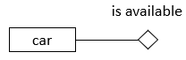
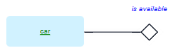
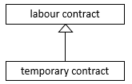
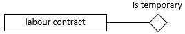

# Unary verb concepts

> [!NOTE]
> **See also:** [A minimal toolkit of SBVR vocabulary concepts](/docs/Business%20rules/Vocabulary%20concepts/A%20minimal%20toolkit%20of%20SBVR%20vocabulary%20concepts.md)

 

*Naming, colour-coding:*

*SBVR, graphism:*

*USoft Studio, graphism:*

*USoft Studio, declaration pattern:*

## About unary verb concepts

### Over time, objects go "in and out” being involved in unary verb concepts

A unary verb concept is a verb concept that involves just 1 noun concept in a role.

Use a unary verb concept when objects designated by the noun go "in and out” playing the role over time.

Examples include:

- Cars becoming available and then unavailable
- People being married or single
- Things reaching a stage or milestone in time: investigations being closed and re-opened

### Contrast unary verb concepts and categories

The fact that an object has an *innate* property that never changes over time is better modelled as a category and not as a unary verb concept:

rather than:

### Binary verb concepts are often more appropriate in USoft

In USoft you often model with the ultimate goal of producing a supporting administrative software application.

Unary verb concepts usually lead to Yes/No checkboxes in a database table when you come to implement them in a USoft application.

However, in USoft application modelling, binary verb concepts are often more practical, because the USoft platform is very strong at matching and relating instances in dual relationships. Consider having the concept:

car*is available to*rental

as an alternative to:

car*is available*

### Other verbs than 'is’

The linking verb in the middle of a unary verb concept is very likely the word **is**.

Sometimes it is another verb. In these cases, USoft Studio currently has the limitation that it cannot recognise unary verb concepts with verbs other than "is”. This is not just a limitation: there is another side to this issue. You can certainly decide to model

storage depot*has limited storage capacity*

and this would be a valid idea, but it is often more appropriate to model the storage capacity and its various possible degrees as separate concepts.